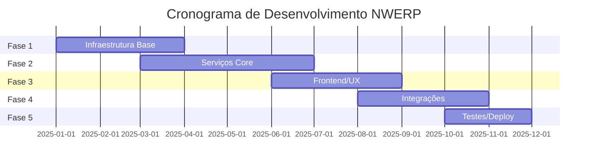

## Visão Geral do Projeto

**NWERP** é um sistema ERP completo baseado em microserviços para empresas brasileiras, com foco em integração fiscal, gestão empresarial e arquitetura moderna.

<CardGroup cols={3}>
  <Card title="Story Points" icon="chart-line">
    **475 SP** total
  </Card>
  <Card title="Prazo Estimado" icon="calendar">
    **9-10 meses**
  </Card>
  <Card title="Investimento" icon="dollar-sign">
    **R$ 1,15M - 1,40M**
  </Card>
</CardGroup>

## Métricas do Código

### Resumo Quantitativo

<Tabs>
  <Tab title="Backend">
    <CardGroup cols={2}>
      <Card title="Arquivos C#" icon="file-code">
        **4.471** arquivos
      </Card>
      <Card title="Arquivos SQL" icon="database">
        **1.939** arquivos
      </Card>
    </CardGroup>
  </Tab>

  <Tab title="Frontend">
    <CardGroup cols={2}>
      <Card title="Arquivos TypeScript" icon="file-code">
        **13.560** arquivos
      </Card>
      <Card title="Total de Linhas" icon="code">
        **349.029** linhas
      </Card>
    </CardGroup>
  </Tab>

  <Tab title="Infraestrutura">
    <CardGroup cols={2}>
      <Card title="Docker Files" icon="docker">
        **10** Dockerfiles
      </Card>
      <Card title="Docker Compose" icon="layer-group">
        **12** arquivos
      </Card>
    </CardGroup>
  </Tab>

  <Tab title="Bridge Services">
    <CardGroup cols={2}>
      <Card title="Serviços" icon="gears">
        **529** serviços
      </Card>
      <Card title="Linhas de Código" icon="code">
        **24.893** linhas
      </Card>
    </CardGroup>
  </Tab>
</Tabs>

### Stack Tecnológico

<CardGroup cols={3}>
  <Card title=".NET 9" icon="microsoft">
    Framework Backend
  </Card>
  <Card title="Angular 19" icon="angular">
    Framework Frontend
  </Card>
  <Card title="PostgreSQL/Oracle" icon="database">
    Banco de Dados
  </Card>
  <Card title="RabbitMQ" icon="rabbit">
    Message Broker
  </Card>
  <Card title="Docker" icon="docker">
    Containerização
  </Card>
  <Card title="Kubernetes" icon="dharmachakra">
    Orquestração
  </Card>
</CardGroup>

## Componentes Principais

<Tabs>
  <Tab title="Backoffice">
    ### Backoffice (Administração)
    
    **Funcionalidades:**
    - Gestão multi-tenant
    - Planos de assinatura
    - Alocação de recursos
    - Gerenciamento de usuários
    
    **Complexidade:** Alta ⚠️
  </Tab>

  <Tab title="Bridge/Winthor">
    ### Bridge/Winthor (Integração ERP Legacy)
    
    **Funcionalidades:**
    - **529 serviços** de integração
    - Sincronização Oracle ↔ PostgreSQL
    - Processamento de filas
    - Background jobs
    
    **Complexidade:** Média (Geração Automática) ✅
  </Tab>

  <Tab title="GoPosify">
    ### GoPosify (PDV/Frontend)
    
    **Funcionalidades:**
    - Interface Angular 19 moderna
    - **64 dependências** principais
    - Interface responsiva
    - PWA capabilities
    
    **Complexidade:** Média-Alta ⚠️
  </Tab>

  <Tab title="Infraestrutura">
    ### Infraestrutura
    
    **Funcionalidades:**
    - HTTP AMQP Broker
    - Gateway API
    - Orquestração de serviços
    - Service Discovery
    
    **Complexidade:** Alta ⚠️
  </Tab>
</Tabs>

## Story Points e Complexidade

### Distribuição por Componente

| Componente | Story Points | Complexidade | Justificativa |
|------------|-------------|--------------|---------------|
| **Core Infrastructure** | 40 SP | 🔴 Alta | Microserviços, messaging, observabilidade |
| **Bridge Services** | 80 SP | 🟡 Média | 529 serviços padronizados (geração automática) |
| **Backoffice Admin** | 60 SP | 🔴 Alta | Multi-tenancy, recursos avançados |
| **GoPosify Frontend** | 50 SP | 🟠 Média-Alta | Angular moderno, 64 deps, UX complexa |
| **Winthor Integration** | 70 SP | 🔴 Alta | Integração legacy Oracle/PostgreSQL |
| **Gateway & API** | 35 SP | 🟡 Média | Roteamento, autenticação |
| **SPED/Fiscal** | 45 SP | 🔴 Alta | Compliance fiscal brasileiro |
| **Orquestração** | 25 SP | 🟡 Média | Workflows e coordenação |
| **Containerização** | 30 SP | 🟡 Média | Docker, CI/CD, deploy |
| **Testes & QA** | 40 SP | 🟡 Média | Testes integrados, qualidade |

<CardGroup cols={2}>
  <Card title="Total de Story Points" icon="chart-bar">
    **475 SP** distribuídos
  </Card>
  <Card title="Complexidade Média" icon="gauge">
    **Alta** (Microserviços)
  </Card>
</CardGroup>

## Estimativa de Tempo

### Por Velocidade de Equipe

<Tabs>
  <Tab title="Equipe Senior">
    ### Equipe Senior (30 SP/sprint)
    
    - **Velocidade:** 30 Story Points por sprint
    - **Sprints necessárias:** 16 sprints
    - **Duração:** **8 meses**
    
    <Check>
      Ideal para projetos com deadline apertado
    </Check>
  </Tab>

  <Tab title="Equipe Mista">
    ### Equipe Mista (25 SP/sprint)
    
    - **Velocidade:** 25 Story Points por sprint
    - **Sprints necessárias:** 19 sprints
    - **Duração:** **9,5 meses** ⭐
    
    <Check>
      **Recomendado** - Melhor custo-benefício
    </Check>
  </Tab>

  <Tab title="Equipe Junior">
    ### Equipe Junior (20 SP/sprint)
    
    - **Velocidade:** 20 Story Points por sprint
    - **Sprints necessárias:** 24 sprints
    - **Duração:** **12 meses**
    
    <Warning>
      Maior risco e tempo de desenvolvimento
    </Warning>
  </Tab>
</Tabs>

### Por Fase de Desenvolvimento

<AccordionGroup>
  <Accordion title="Fase 1: Infraestrutura Base (2-3 meses)" icon="layer-group">
    **Entregas:**
    - Setup de microserviços
    - RabbitMQ e mensageria
    - PostgreSQL multi-tenant
    - Redis cache
    - Observabilidade básica
    - CI/CD pipeline
    
    **Complexidade:** 🔴 Alta
  </Accordion>

  <Accordion title="Fase 2: Serviços Core (3-4 meses)" icon="gears">
    **Entregas:**
    - Backoffice completo
    - Gateway API
    - Bridge Services (529 serviços)
    - Winthor Integration
    - Autenticação e autorização
    
    **Complexidade:** 🔴 Alta
  </Accordion>

  <Accordion title="Fase 3: Frontend/UX (2-3 meses)" icon="palette">
    **Entregas:**
    - GoPosify Angular 19
    - Interface responsiva
    - PWA implementation
    - UX design system
    - Componentes reutilizáveis
    
    **Complexidade:** 🟠 Média-Alta
  </Accordion>

  <Accordion title="Fase 4: Integrações (2-3 meses)" icon="link">
    **Entregas:**
    - Integração Winthor completa
    - SPED/NFe
    - Sincronização Oracle ↔ PostgreSQL
    - APIs externas
    - Webhooks
    
    **Complexidade:** 🔴 Alta
  </Accordion>

  <Accordion title="Fase 5: Testes/Deploy (1-2 meses)" icon="check">
    **Entregas:**
    - Testes de integração
    - Testes de carga
    - Deploy em produção
    - Documentação
    - Treinamento
    
    **Complexidade:** 🟡 Média
  </Accordion>
</AccordionGroup>

## Estimativa de Custo

### Equipe Recomendada (Brasil)

| Cargo | Qtd | Salário/Mês | Total/Mês |
|-------|-----|-------------|-----------|
| **Tech Lead** | 1 | R$ 18.000 | R$ 18.000 |
| **Senior .NET** | 2 | R$ 15.000 | R$ 30.000 |
| **Senior Angular** | 2 | R$ 13.000 | R$ 26.000 |
| **Pleno Backend** | 2 | R$ 10.000 | R$ 20.000 |
| **DevOps** | 1 | R$ 14.000 | R$ 14.000 |
| **QA/Tester** | 1 | R$ 8.000 | R$ 8.000 |
| **TOTAL** | **9** | - | **R$ 116.000/mês** |

### Custo Total por Cenário

<Tabs>
  <Tab title="Cenário 1: Equipe Senior">
    **8 meses de desenvolvimento**
    
    - **Equipe:** R$ 116.000/mês × 8 = **R$ 928.000**
    - **Infraestrutura:** R$ 15.000/mês × 8 = R$ 120.000
    - **Licenças:** R$ 5.000/mês × 8 = R$ 40.000
    - **Subtotal:** R$ 1.088.000
    - **Contingência (20%):** R$ 217.600
    
    ### Total: **R$ 1.305.600**
    
    <Info>
      Prazo mais curto, custo mais alto
    </Info>
  </Tab>

  <Tab title="Cenário 2: Equipe Mista ⭐">
    **9,5 meses de desenvolvimento**
    
    - **Equipe:** R$ 116.000/mês × 9.5 = **R$ 1.102.000**
    - **Infraestrutura:** R$ 15.000/mês × 9.5 = R$ 142.500
    - **Licenças:** R$ 5.000/mês × 9.5 = R$ 47.500
    - **Subtotal:** R$ 1.292.000
    - **Contingência (20%):** R$ 258.400
    
    ### Total: **R$ 1.550.400**
    
    <Check>
      **RECOMENDADO** - Melhor equilíbrio
    </Check>
  </Tab>

  <Tab title="Cenário 3: Equipe Junior">
    **12 meses de desenvolvimento**
    
    - **Equipe:** R$ 116.000/mês × 12 = **R$ 1.392.000**
    - **Infraestrutura:** R$ 15.000/mês × 12 = R$ 180.000
    - **Licenças:** R$ 5.000/mês × 12 = R$ 60.000
    - **Subtotal:** R$ 1.632.000
    - **Contingência (20%):** R$ 326.400
    
    ### Total: **R$ 1.958.400**
    
    <Warning>
      Maior risco de atrasos e retrabalho
    </Warning>
  </Tab>
</Tabs>

### Custos Adicionais

<AccordionGroup>
  <Accordion title="Infraestrutura Cloud (R$ 15.000/mês)" icon="cloud">
    - **PostgreSQL:** R$ 3.000/mês (RDS ou equivalente)
    - **Redis:** R$ 1.500/mês
    - **RabbitMQ:** R$ 2.000/mês
    - **Kubernetes:** R$ 5.000/mês (EKS/GKE)
    - **CDN & Storage:** R$ 1.500/mês
    - **Monitoring:** R$ 2.000/mês (Grafana Cloud, DataDog)
  </Accordion>

  <Accordion title="Licenças & Ferramentas (R$ 5.000/mês)" icon="key">
    - **JetBrains Suite:** R$ 1.500/mês (9 licenças)
    - **GitHub Enterprise:** R$ 1.000/mês
    - **Jira/Confluence:** R$ 1.000/mês
    - **SSL Certificates:** R$ 300/mês
    - **Domain & DNS:** R$ 200/mês
    - **Outros:** R$ 1.000/mês
  </Accordion>

  <Accordion title="Contingência (20%)" icon="shield">
    **Cobertura para:**
    - Mudanças de escopo
    - Bugs críticos inesperados
    - Integrações mais complexas
    - Necessidade de recursos extras
    - Atrasos por dependências externas
  </Accordion>
</AccordionGroup>

## Cenário Recomendado

<Card title="Estimativa Final Recomendada" icon="check-double">
  ### Configuração Ideal
  
  - **Prazo:** 9-10 meses
  - **Equipe:** 9 desenvolvedores (mista)
  - **Custo Total:** R$ 1.150.000 - R$ 1.400.000
  - **Story Points:** 475 SP
  - **Velocidade:** 25 SP/sprint
  
  <CardGroup cols={3}>
    <Card title="Melhor Custo-Benefício" icon="dollar-sign">
      Equilibra custo e prazo
    </Card>
    <Card title="Risco Controlado" icon="shield-halved">
      Equipe experiente
    </Card>
    <Card title="Qualidade Alta" icon="star">
      Tempo adequado
    </Card>
  </CardGroup>
</Card>

## Análise de Riscos

### Fatores de Risco por Nível

<Tabs>
  <Tab title="Baixo Risco ✅">
    **Componentes com risco baixo:**
    
    - Bridge Services (código padronizado)
    - Frontend moderno (Angular 19 bem suportado)
    - Containerização (Docker/K8s maduros)
    - Testes automatizados
    
    <Check>
      Tecnologias maduras e bem documentadas
    </Check>
  </Tab>

  <Tab title="Risco Médio ⚠️">
    **Componentes com risco médio:**
    
    - Integração legacy Winthor (Oracle)
    - Compliance fiscal brasileiro (NFe, SPED)
    - Multi-tenancy complexo
    - Sincronização de dados
    
    <Warning>
      Requer atenção especial e validação constante
    </Warning>
  </Tab>

  <Tab title="Alto Risco 🔴">
    **Componentes com risco alto:**
    
    - Complexidade microserviços
    - Observabilidade e debugging distribuído
    - Performance em escala
    - Migração de dados legados
    
    <Note>
      Investir em protótipos e provas de conceito
    </Note>
  </Tab>
</Tabs>

### Matriz de Riscos

| Risco | Probabilidade | Impacto | Mitigação |
|-------|--------------|---------|-----------|
| Complexidade Microserviços | 🔴 Alta | 🔴 Alto | Arquitetura bem definida, documentação |
| Integração Winthor | 🟡 Média | 🔴 Alto | Testes extensivos, rollback plans |
| Compliance Fiscal | 🟡 Média | 🔴 Alto | Consultoria especializada |
| Performance | 🟡 Média | 🟡 Médio | Load testing, monitoring |
| Mudança de Escopo | 🔴 Alta | 🟡 Médio | Gestão ágil, sprints curtas |

## Pontos Positivos

<CardGroup cols={2}>
  <Card title="Arquitetura Bem Definida" icon="sitemap">
    Clean Architecture e DDD implementados
  </Card>
  <Card title="Código Padronizado" icon="code">
    Bridge Services com padrão consistente
  </Card>
  <Card title="Tecnologias Modernas" icon="microchip">
    .NET 9, Angular 19, Docker, K8s
  </Card>
  <Card title="Containerização" icon="docker">
    Deploy facilitado e escalável
  </Card>
</CardGroup>

## Pontos de Atenção

<AccordionGroup>
  <Accordion title="529 Bridge Services" icon="gears">
    **Desafio:** Alta complexidade de manutenção
    
    **Recomendação:** 
    - Implementar Code Generation
    - Documentação automatizada
    - Testes unitários padronizados
  </Accordion>

  <Accordion title="Sistema Legacy Winthor" icon="database">
    **Desafio:** Integração com Oracle e processos antigos
    
    **Recomendação:**
    - Camada de abstração robusta
    - Testes de integração extensivos
    - Monitoramento de sincronização
  </Accordion>

  <Accordion title="Compliance Fiscal Brasileiro" icon="file-invoice">
    **Desafio:** NFe, SPED, ICMS, complexidade tributária
    
    **Recomendação:**
    - Consultoria fiscal especializada
    - Certificações digitais
    - Ambiente de homologação SEFAZ
  </Accordion>

  <Accordion title="Arquitetura Microserviços" icon="cubes">
    **Desafio:** Complexidade operacional distribuída
    
    **Recomendação:**
    - Service mesh (Istio/Linkerd)
    - Distributed tracing
    - Chaos engineering
  </Accordion>
</AccordionGroup>

## Recomendações

<Steps>
  <Step title="Priorizar Infraestrutura">
    Implementar base sólida de microserviços, messaging e observabilidade desde o início
  </Step>
  
  <Step title="Automatizar CI/CD">
    Pipeline completo de build, test e deploy automatizado
  </Step>
  
  <Step title="Documentar APIs">
    OpenAPI/Swagger para todos os endpoints e contratos entre serviços
  </Step>
  
  <Step title="Implementar Monitoring">
    Observabilidade com OpenTelemetry, Grafana, Prometheus desde o dia 1
  </Step>
  
  <Step title="Code Generation">
    Considerar geração de código para manutenção dos 529 Bridge Services
  </Step>
  
  <Step title="Testes Automatizados">
    Cobertura mínima de 80% em componentes críticos
  </Step>
</Steps>

## Próximos Passos

<CardGroup cols={2}>
  <Card title="Estatísticas" icon="chart-bar" href="/nwerp/architecture/statistics">
    Veja as estatísticas completas do projeto
  </Card>
  <Card title="Classes" icon="diagram-project" href="/nwerp/architecture/classes">
    Explore as classes principais
  </Card>
  <Card title="Visão Geral" icon="sitemap" href="/nwerp/architecture/overview">
    Entenda a arquitetura geral
  </Card>
  <Card title="Início Rápido" icon="rocket" href="/nwerp/quickstart">
    Comece a desenvolver
  </Card>
</CardGroup>

---

<Info>
  **Nota:** Estimativa gerada em Outubro 2025
  
  Base de análise: 349.029 linhas de código, 475 Story Points
</Info>

