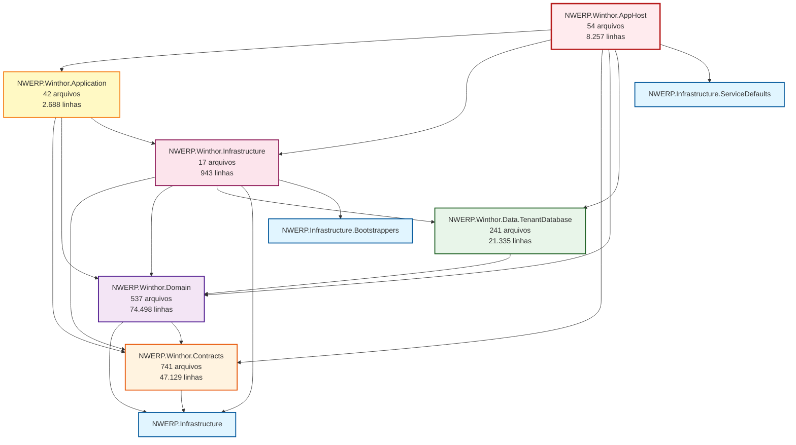
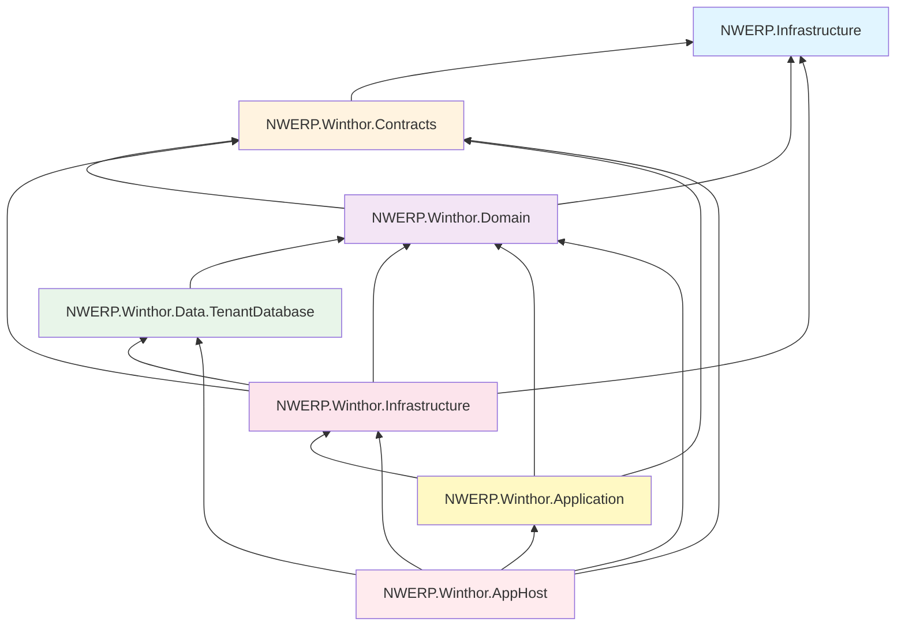

## Resumo Geral

O NWERP é uma solução empresarial robusta e escalável, construída com arquitetura de microserviços moderna.

<CardGroup cols={3}>
  <Card title="Projetos" icon="folder">
    **44** projetos .csproj
  </Card>
  <Card title="Classes" icon="file-code">
    **4.305** arquivos .cs
  </Card>
  <Card title="Linhas de Código" icon="code">
    **1.041.611** linhas
  </Card>
</CardGroup>

## Projetos por Categoria

### Core Components

<Card title="Infraestrutura Core" icon="cubes">
  **8 projetos** que formam a base da plataforma
  
  - NWERP.Infrastructure
  - NWERP.Infrastructure.Bootstrappers
  - NWERP.Infrastructure.HttpAmqpBroker
  - NWERP.Infrastructure.IntegratedTests
  - NWERP.Infrastructure.ServiceDefaults
  - NWERP.ApplicationServices.Abstractions
  - NWERP.Infrastructure.Data.MainDatabase
  - NWERP.Infrastructure.ResourceManager
</Card>

### Distribuição de Projetos

<Tabs>
  <Tab title="Backoffice">
    **7 projetos** para administração e gestão multi-tenant
    
    - NWERP.Backoffice.Application
    - NWERP.Backoffice.AppHost
    - NWERP.Backoffice.Contracts
    - NWERP.Backoffice.Domain
    - NWERP.Backoffice.Infrastructure
    - NWERP.Backoffice.IntegratedTests
    - NWERP.Backoffice.UnitTests
  </Tab>

  <Tab title="Winthor">
    **7 projetos** para integração com ERP legacy
    
    - NWERP.Winthor.Application
    - NWERP.Winthor.AppHost
    - NWERP.Winthor.Contracts
    - NWERP.Winthor.Domain
    - NWERP.Winthor.Infrastructure
    - NWERP.Winthor.IntegratedTests
    - NWERP.Winthor.Data.TenantDatabase
    
    <Note>
      **Total Winthor:** 1.632 arquivos | 154.850 linhas de código
    </Note>
  </Tab>

  <Tab title="Bridge">
    **6 projetos** para integração e sincronização
    
    - NWERP.Bridge.Application
    - NWERP.Bridge.AppHost
    - NWERP.Bridge.Contracts
    - NWERP.Bridge.Domain
    - NWERP.Bridge.Infrastructure
    - NWERP.Bridge.Data.TenantDatabase
  </Tab>

  <Tab title="Orchestration">
    **6 projetos** para orquestração de workflows
    
    - NWERP.Orchestration.Application
    - NWERP.Orchestration.AppHost
    - NWERP.Orchestration.Contracts
    - NWERP.Orchestration.Domain
    - NWERP.Orchestration.Infrastructure
    - NWERP.Orchestration.Data.TenantDatabase
  </Tab>

  <Tab title="Outros Módulos">
    **Argos** - 3 projetos
    - NWERP.Argos.AppHost
    - NWERP.Argos.Core
    - NWERP.Argos.Infra
    
    **GoPosify** - 1 projeto
    - NWERP.GoPosify.WebApp
    
    **SPED/NFe** - 4 projetos
    - NFe.AppTeste.NetCore
    - NFe.Danfe.Base
    - NFe.Danfe.OpenFast
    - NFe.Danfe.AppTeste.OpenFast
    
    **Website** - 2 projetos
    - NWERP.Backoffice.WebApp
    - NWERP.Backoffice.IntegratedTests
  </Tab>
</Tabs>

## Análise Detalhada - Módulo Winthor

O módulo Winthor é o maior componente do sistema, responsável pela integração com o sistema legacy.

### Métricas do Módulo

<CardGroup cols={2}>
  <Card title="Total de Arquivos" icon="files">
    **1.632** arquivos de código
  </Card>
  <Card title="Linhas de Código" icon="code">
    **154.850** linhas
  </Card>
  <Card title="Projetos" icon="folder">
    **7** projetos especializados
  </Card>
  <Card title="Services" icon="gears">
    **23** serviços principais
  </Card>
</CardGroup>

### Arquitetura do Módulo Winthor

O módulo segue os princípios de **Clean Architecture** e **Domain-Driven Design (DDD)**.

### Detalhamento por Camada

<AccordionGroup>
  <Accordion title="AppHost - Camada de Apresentação" icon="server">
    **54 arquivos | 8.257 linhas**
    
    - 14 Endpoints REST
    - Configuração de serviços
    - Jobs do Hangfire
    - Workloads especializados
  </Accordion>

  <Accordion title="Application - Camada de Aplicação" icon="cogs">
    **42 arquivos | 2.688 linhas**
    
    **23 Services principais:**
    - AutorizacaoService
    - CargaTotalNuvemService
    - ClienteFVService
    - CotacaoFVService
    - EstoqueIdealService
    - IntegracaoService
    - MonitorService
    - OrcamentoFVService
    - ParametrosService
    - PedidoPolibrasService
    - PedidoService
    - PreEntradaService
    - ScriptsService
    
    **Serviços Especializados:**
    - **Coagro:** Serviços específicos para cooperativa
    - **Compras/GiroDia:** Gestão de compras e giro de estoque
    - **Kinitos:** 5 serviços de integração
      - FaturamentoService
      - PedidoVendaService
      - ConsolidarEstoqueService
      - EntradaService
      - DevolucaoService
  </Accordion>

  <Accordion title="Contracts - Contratos e DTOs" icon="file-contract">
    **741 arquivos | 47.129 linhas**
    
    - **63 entidades** (Entity)
    - **560 Transfer Objects** (TO)
    
    **Principais TOs:**
    - Compras
    - EstoqueIdeal
    - WmsAbastecimento
    - Events
    - Customizado
  </Accordion>

  <Accordion title="Domain - Camada de Domínio" icon="cube">
    **537 arquivos | 74.498 linhas**
    
    Contém a lógica de negócio central:
    - Entidades de domínio
    - Agregados
    - Value Objects
    - Domain Events
    - Regras de negócio
    
    **Módulos principais:**
    - Compras
    - Estoque
    - Vendas
    - Força de Vendas
  </Accordion>

  <Accordion title="Data.TenantDatabase - Camada de Dados" icon="database">
    **241 arquivos | 21.335 linhas**
    
    - EF Core Context
    - Repositórios
    - Dapper Queries
    - Oracle Database
    - Suporte multi-tenant
    - Mapeamentos
    - Migrações
  </Accordion>

  <Accordion title="Infrastructure - Infraestrutura" icon="toolbox">
    **17 arquivos | 943 linhas**
    
    - Adaptadores RabbitMQ
    - Adaptadores Hangfire
    - Implementações MediatR
    - Redis Cache
    - Integrações externas
  </Accordion>
</AccordionGroup>

### Stack Tecnológico

<Tabs>
  <Tab title="Frameworks">
    - **.NET 9.0** - Framework principal
    - **ASP.NET Core** - Web API e hosting
    - **Entity Framework Core 9.0** - ORM
    - **Blazor** / **MudBlazor** - UI Components
  </Tab>

  <Tab title="Banco de Dados">
    - **Oracle Database** - Banco principal
    - Oracle.EntityFrameworkCore 9.23.60
    - **Dapper** - Micro-ORM para performance
    - **Multi-tenant** - Suporte a múltiplos tenants
  </Tab>

  <Tab title="Mensageria & Jobs">
    - **RabbitMQ** (Oragon.RabbitMQ)
    - **Hangfire** - Background jobs
    - **MediatR** - Mediator pattern / CQRS
  </Tab>

  <Tab title="Cache & Performance">
    - **Redis** (Aspire.StackExchange.Redis)
    - **OpenTelemetry** - Observabilidade
    - **Grafana OpenTelemetry** - Monitoramento
  </Tab>

  <Tab title="Qualidade">
    - **FluentValidation** - Validação de objetos
    - **xUnit** - Testes unitários
    - **SSH.NET** - Conexões SSH/SFTP
  </Tab>

  <Tab title="DevOps">
    - **Docker** - Containerização
    - **.NET Aspire** - Orquestração de microserviços
    - **Scalar/Swagger** - Documentação de API
  </Tab>
</Tabs>

## Funcionalidades do Módulo Winthor

<CardGroup cols={2}>
  <Card title="Gestão de Compras" icon="cart-shopping">
    - Análise de giro de estoque
    - Sugestão de compras
    - Cotações
  </Card>
  <Card title="Integração Kinitos" icon="arrows-rotate">
    - Sincronização de pedidos
    - Faturamento
    - Controle de estoque
    - Devoluções
  </Card>
  <Card title="Força de Vendas (FV)" icon="users">
    - Gestão de clientes
    - Orçamentos
    - Cotações
  </Card>
  <Card title="Estoque" icon="warehouse">
    - Estoque ideal
    - WMS e abastecimento
    - Consolidação
  </Card>
</CardGroup>

### Principais Entidades

<Accordion title="Entidades de Domínio" icon="database">
  Algumas das entidades principais do domínio:
  
  - **Produto** - Cadastro de produtos
  - **Categoria/Departamento** - Organização de produtos
  - **Cliente/Destinatário** - Gestão de clientes
  - **NotaFiscal** - Documentos fiscais
  - **Pedido** - Gestão de pedidos
  - **Supervisor** - Gestão de equipe
  - **Praça** - Regiões de atuação
  - **Roteio de Visitas** - Planejamento de visitas
</Accordion>

## Princípios Arquiteturais

<CardGroup cols={2}>
  <Card title="Separation of Concerns" icon="layer-group">
    Cada camada tem responsabilidades bem definidas
  </Card>
  <Card title="Dependency Inversion" icon="arrow-down-up-across-line">
    Camadas superiores não dependem de implementações
  </Card>
  <Card title="Single Responsibility" icon="bullseye">
    Cada classe tem uma única razão para mudar
  </Card>
  <Card title="Open/Closed" icon="door-open">
    Aberto para extensão, fechado para modificação
  </Card>
  <Card title="Interface Segregation" icon="puzzle-piece">
    Interfaces específicas para cada cliente
  </Card>
  <Card title="Multi-tenancy" icon="building">
    Suporte nativo a múltiplos tenants
  </Card>
</CardGroup>

## Fluxo de Dependências

<Note>
  A arquitetura segue o princípio de **dependências unidirecionais**, onde as camadas externas dependem das camadas internas, mas nunca o contrário.
</Note>

## Resumo Executivo

<CardGroup cols={3}>
  <Card title="Total de Projetos" icon="folder-tree">
    **44** projetos .csproj
  </Card>
  <Card title="Total de Classes" icon="file-code">
    **4.305** arquivos
  </Card>
  <Card title="Total de Código" icon="code">
    **1.041.611** linhas
  </Card>
</CardGroup>

<Info>
  **Nota:** Os números excluem arquivos em diretórios `bin/`, `obj/` e `node_modules/`
  
  *Estatísticas geradas em: 13/11/2025*
</Info>

## Próximos Passos

<CardGroup cols={2}>
  <Card title="Classes Principais" icon="list" href="/nwerp/architecture/classes">
    Veja a lista de classes principais
  </Card>
  <Card title="Estimativa de Desenvolvimento" icon="calendar" href="/nwerp/architecture/estimates">
    Consulte as estimativas do projeto
  </Card>
  <Card title="Visão Geral" icon="diagram-project" href="/nwerp/architecture/overview">
    Entenda a arquitetura geral
  </Card>
  <Card title="Componentes" icon="cubes" href="/nwerp/components/core">
    Explore os componentes
  </Card>
</CardGroup>

