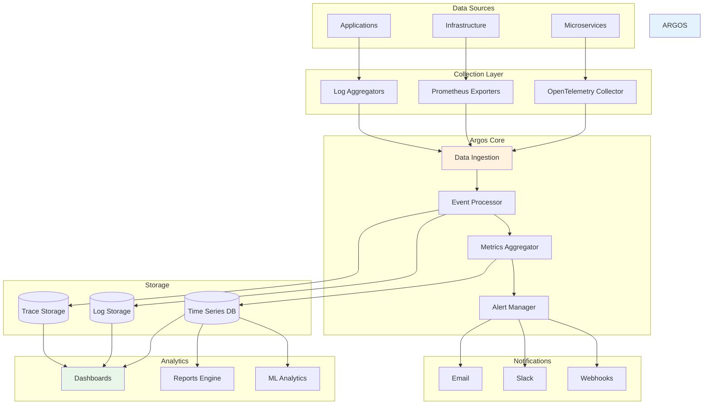

## Introdução

O Argos Service é o "olho que tudo vê" do ecossistema NWERP. Nomeado em homenagem ao gigante da mitologia grega com cem olhos, este serviço fornece monitoramento completo, observabilidade e analytics para toda a plataforma.

<CardGroup cols={2}>
  <Card title="Monitoring" icon="chart-line">
    Monitoramento em tempo real
  </Card>
  <Card title="Logging" icon="file-lines">
    Centralização de logs
  </Card>
  <Card title="Tracing" icon="route">
    Distributed tracing
  </Card>
  <Card title="Analytics" icon="chart-pie">
    Analytics e relatórios
  </Card>
</CardGroup>

## Arquitetura

### Visão Geral



## Funcionalidades Principais

### 1. Métricas e Monitoramento

Coleta e visualização de métricas de toda a plataforma.

<Tabs>
  <Tab title="System Metrics">
    **Métricas de Sistema:**
    
    - **CPU Usage** - Uso de CPU por serviço
    - **Memory Usage** - Consumo de memória
    - **Disk I/O** - Leitura/escrita em disco
    - **Network Traffic** - Tráfego de rede
    - **Container Stats** - Estatísticas de containers
    
    ```csharp
    public class SystemMetricsCollector
    {
        private readonly IMetricsRegistry _metrics;
        
        public void Configure()
        {
            // CPU
            _metrics.CreateGauge(
                "system_cpu_usage_percent",
                "Uso de CPU em percentual",
                () => GetCpuUsage());
            
            // Memory
            _metrics.CreateGauge(
                "system_memory_usage_bytes",
                "Uso de memória em bytes",
                () => GetMemoryUsage());
            
            // Disk
            _metrics.CreateGauge(
                "system_disk_usage_percent",
                "Uso de disco em percentual",
                () => GetDiskUsage());
        }
    }
    ```
  </Tab>

  <Tab title="Application Metrics">
    **Métricas de Aplicação:**
    
    - **Request Rate** - Taxa de requisições
    - **Response Time** - Tempo de resposta
    - **Error Rate** - Taxa de erros
    - **Throughput** - Vazão de dados
    - **Active Users** - Usuários ativos
    
    ```csharp
    public class ApplicationMetricsCollector
    {
        public void Configure()
        {
            // Requisições por segundo
            Metrics.CreateCounter(
                "app_requests_total",
                "Total de requisições",
                new CounterConfiguration
                {
                    LabelNames = new[] { "service", "method", "endpoint" }
                });
            
            // Latência
            Metrics.CreateHistogram(
                "app_request_duration_seconds",
                "Duração das requisições",
                new HistogramConfiguration
                {
                    Buckets = new[] { 0.01, 0.05, 0.1, 0.5, 1, 2, 5 }
                });
            
            // Erros
            Metrics.CreateCounter(
                "app_errors_total",
                "Total de erros",
                new CounterConfiguration
                {
                    LabelNames = new[] { "service", "error_type" }
                });
        }
    }
    ```
  </Tab>

  <Tab title="Business Metrics">
    **Métricas de Negócio:**
    
    - **Orders Per Hour** - Pedidos por hora
    - **Revenue** - Receita
    - **Active Tenants** - Tenants ativos
    - **User Growth** - Crescimento de usuários
    - **Feature Usage** - Uso de funcionalidades
    
    ```csharp
    public class BusinessMetricsCollector
    {
        public void TrackOrder(Order order)
        {
            Metrics.Increment(
                "business_orders_total",
                tags: new[] { $"tenant:{order.TenantId}" });
            
            Metrics.Measure(
                "business_order_value",
                order.TotalValue,
                tags: new[] { $"tenant:{order.TenantId}" });
        }
        
        public void TrackUserActivity(string userId)
        {
            Metrics.Increment(
                "business_active_users",
                tags: new[] { "period:hourly" });
        }
    }
    ```
  </Tab>
</Tabs>

### 2. Centralização de Logs

Sistema centralizado para coleta, armazenamento e análise de logs.

```csharp
public class LoggingConfiguration
{
    public void ConfigureLogging(ILoggingBuilder logging)
    {
        logging
            .AddOpenTelemetry(options =>
            {
                options.IncludeScopes = true;
                options.IncludeFormattedMessage = true;
                
                options.AddOtlpExporter(otlpOptions =>
                {
                    otlpOptions.Endpoint = new Uri("http://argos:4317");
                });
            });
        
        // Enriquecimento de logs
        logging.AddEnricher<TenantEnricher>();
        logging.AddEnricher<CorrelationIdEnricher>();
        logging.AddEnricher<UserEnricher>();
    }
}

public class TenantEnricher : ILogEnricher
{
    public void Enrich(LogEvent logEvent, ILogEventPropertyFactory factory)
    {
        var tenantId = TenantContext.Current?.TenantId;
        if (!string.IsNullOrEmpty(tenantId))
        {
            logEvent.AddProperty(
                factory.CreateProperty("TenantId", tenantId));
        }
    }
}
```

**Structured Logging:**

```csharp
_logger.LogInformation(
    "Order {OrderId} created for customer {CustomerId} " +
    "with {ItemCount} items totaling {TotalValue:C}",
    order.Id,
    order.CustomerId,
    order.Items.Count,
    order.TotalValue);
```

### 3. Distributed Tracing

Rastreamento de requisições através de múltiplos serviços.

<Tabs>
  <Tab title="Instrumentação">
    ```csharp
    public class TracingConfiguration
    {
        public void ConfigureTracing(IServiceCollection services)
        {
            services.AddOpenTelemetry()
                .WithTracing(builder =>
                {
                    builder
                        .SetResourceBuilder(ResourceBuilder
                            .CreateDefault()
                            .AddService("nwerp"))
                        .AddAspNetCoreInstrumentation(options =>
                        {
                            options.RecordException = true;
                            options.EnrichWithHttpRequest = EnrichHttpRequest;
                            options.EnrichWithHttpResponse = EnrichHttpResponse;
                        })
                        .AddHttpClientInstrumentation()
                        .AddEntityFrameworkCoreInstrumentation()
                        .AddRedisInstrumentation()
                        .AddOtlpExporter(options =>
                        {
                            options.Endpoint = new Uri("http://argos:4317");
                        });
                });
        }
        
        private void EnrichHttpRequest(Activity activity, HttpRequest request)
        {
            activity.SetTag("tenant.id", request.Headers["X-Tenant-Id"]);
            activity.SetTag("user.id", request.HttpContext.User.Identity?.Name);
            activity.SetTag("correlation.id", request.Headers["X-Correlation-Id"]);
        }
    }
    ```
  </Tab>

  <Tab title="Custom Spans">
    ```csharp
    public class OrderService
    {
        private readonly ActivitySource _activitySource;
        
        public OrderService()
        {
            _activitySource = new ActivitySource("NWERP.OrderService");
        }
        
        public async Task<Order> CreateOrderAsync(CreateOrderRequest request)
        {
            using var activity = _activitySource.StartActivity(
                "CreateOrder",
                ActivityKind.Internal);
            
            activity?.SetTag("order.customer_id", request.CustomerId);
            activity?.SetTag("order.item_count", request.Items.Count);
            
            try
            {
                // Validar pedido
                using (var validateSpan = _activitySource.StartActivity("ValidateOrder"))
                {
                    await ValidateOrderAsync(request);
                }
                
                // Reservar estoque
                using (var reserveSpan = _activitySource.StartActivity("ReserveInventory"))
                {
                    await ReserveInventoryAsync(request.Items);
                }
                
                // Criar pedido
                var order = await _repository.CreateAsync(request);
                
                activity?.SetTag("order.id", order.Id);
                activity?.SetTag("order.total", order.TotalValue);
                
                return order;
            }
            catch (Exception ex)
            {
                activity?.SetStatus(ActivityStatusCode.Error, ex.Message);
                activity?.RecordException(ex);
                throw;
            }
        }
    }
    ```
  </Tab>
</Tabs>

### 4. Alertas Inteligentes

Sistema de alertas configurável com múltiplos canais de notificação.

```csharp
public class AlertConfiguration
{
    public void ConfigureAlerts()
    {
        // Alert de CPU alta
        AlertRule.Create("high-cpu-usage")
            .When(metrics => metrics["system_cpu_usage_percent"] > 80)
            .For(TimeSpan.FromMinutes(5))
            .WithSeverity(AlertSeverity.Warning)
            .Notify(channels: new[] { "email", "slack" })
            .WithMessage("CPU usage is above 80% for 5 minutes");
        
        // Alert de taxa de erro alta
        AlertRule.Create("high-error-rate")
            .When(metrics => 
                metrics["app_errors_total"] / metrics["app_requests_total"] > 0.05)
            .For(TimeSpan.FromMinutes(1))
            .WithSeverity(AlertSeverity.Critical)
            .Notify(channels: new[] { "email", "slack", "pagerduty" })
            .WithMessage("Error rate is above 5%");
        
        // Alert de serviço inativo
        AlertRule.Create("service-down")
            .When(metrics => metrics["service_health"] == 0)
            .For(TimeSpan.FromMinutes(1))
            .WithSeverity(AlertSeverity.Critical)
            .Notify(channels: new[] { "slack", "pagerduty" })
            .WithMessage("Service {{service_name}} is down");
        
        // Alert de disco cheio
        AlertRule.Create("disk-almost-full")
            .When(metrics => metrics["system_disk_usage_percent"] > 90)
            .For(TimeSpan.FromMinutes(10))
            .WithSeverity(AlertSeverity.Warning)
            .Notify(channels: new[] { "email" })
            .WithMessage("Disk usage is above 90%");
    }
}
```

### 5. Dashboards

Dashboards interativos para visualização de métricas.

<AccordionGroup>
  <Accordion title="System Dashboard" icon="server">
    **Visão Geral do Sistema:**
    
    - CPU, Memória, Disco por serviço
    - Network I/O
    - Container health
    - Resource utilization
    - Uptime
  </Accordion>

  <Accordion title="Application Dashboard" icon="code">
    **Métricas de Aplicação:**
    
    - Request rate
    - Response time (p50, p95, p99)
    - Error rate
    - Throughput
    - Active connections
  </Accordion>

  <Accordion title="Business Dashboard" icon="chart-pie">
    **Métricas de Negócio:**
    
    - Orders per hour/day
    - Revenue
    - Active users
    - Tenant growth
    - Feature adoption
  </Accordion>

  <Accordion title="Tenant Dashboard" icon="building">
    **Visão por Tenant:**
    
    - Resource usage per tenant
    - API calls per tenant
    - Storage per tenant
    - Active users per tenant
  </Accordion>
</AccordionGroup>

## Analytics e Relatórios

### Machine Learning Analytics

```csharp
public class AnomalyDetectionService
{
    private readonly IMLContext _mlContext;
    
    public async Task<List<Anomaly>> DetectAnomaliesAsync(
        string metricName,
        TimeRange timeRange)
    {
        // Buscar dados históricos
        var data = await _metricsStore.GetTimeSeriesAsync(
            metricName, 
            timeRange);
        
        // Treinar modelo
        var model = _mlContext.AnomalyDetection
            .DetectSpikeBySsa(
                data,
                confidence: 95,
                pvalueHistoryLength: 30);
        
        // Detectar anomalias
        var predictions = model.Transform(data);
        
        return predictions
            .Where(p => p.IsAnomaly)
            .Select(p => new Anomaly
            {
                Timestamp = p.Timestamp,
                Value = p.Value,
                Confidence = p.Confidence,
                MetricName = metricName
            })
            .ToList();
    }
}
```

### Relatórios Automáticos

```csharp
public class ReportGenerator
{
    public async Task<Report> GenerateDailyReportAsync(DateTime date)
    {
        var metrics = await _metricsStore.GetDailyMetricsAsync(date);
        
        return new Report
        {
            Title = $"Daily Report - {date:yyyy-MM-dd}",
            Sections = new[]
            {
                new ReportSection
                {
                    Title = "System Health",
                    Data = new
                    {
                        Uptime = metrics.Uptime,
                        AvgCpuUsage = metrics.AvgCpuUsage,
                        AvgMemoryUsage = metrics.AvgMemoryUsage,
                        Incidents = metrics.IncidentCount
                    }
                },
                new ReportSection
                {
                    Title = "Application Performance",
                    Data = new
                    {
                        TotalRequests = metrics.TotalRequests,
                        AvgResponseTime = metrics.AvgResponseTime,
                        ErrorRate = metrics.ErrorRate,
                        Throughput = metrics.Throughput
                    }
                },
                new ReportSection
                {
                    Title = "Business Metrics",
                    Data = new
                    {
                        TotalOrders = metrics.TotalOrders,
                        Revenue = metrics.Revenue,
                        NewUsers = metrics.NewUsers,
                        ActiveTenants = metrics.ActiveTenants
                    }
                }
            }
        };
    }
}
```

## Integração com Ferramentas

<Tabs>
  <Tab title="Prometheus">
    ```yaml
    scrape_configs:
      - job_name: 'nwerp-services'
        static_configs:
          - targets:
            - 'backoffice:80'
            - 'winthor:80'
            - 'bridge:80'
            - 'goposify:80'
        metrics_path: '/metrics'
        scrape_interval: 15s
    ```
  </Tab>

  <Tab title="Grafana">
    ```json
    {
      "dashboard": {
        "title": "NWERP Overview",
        "panels": [
          {
            "title": "Request Rate",
            "targets": [
              {
                "expr": "rate(app_requests_total[5m])"
              }
            ]
          },
          {
            "title": "Error Rate",
            "targets": [
              {
                "expr": "rate(app_errors_total[5m]) / rate(app_requests_total[5m])"
              }
            ]
          }
        ]
      }
    }
    ```
  </Tab>

  <Tab title="Jaeger">
    ```csharp
    services.AddOpenTelemetry()
        .WithTracing(builder =>
        {
            builder.AddJaegerExporter(options =>
            {
                options.AgentHost = "jaeger";
                options.AgentPort = 6831;
            });
        });
    ```
  </Tab>

  <Tab title="ELK Stack">
    ```csharp
    services.AddLogging(builder =>
    {
        builder.AddElasticsearch(options =>
        {
            options.ElasticsearchUrl = "http://elasticsearch:9200";
            options.IndexFormat = "nwerp-logs-{0:yyyy.MM.dd}";
        });
    });
    ```
  </Tab>
</Tabs>

## Deployment

### Docker Compose

```yaml
services:
  argos:
    image: nwerp/argos:latest
    ports:
      - "4317:4317"  # OTLP gRPC
      - "4318:4318"  # OTLP HTTP
      - "8080:80"    # Web UI
    environment:
      - ASPNETCORE_ENVIRONMENT=Production
      - ConnectionStrings__TimeSeries=timescaledb:5432
      - ConnectionStrings__Redis=redis:6379
    depends_on:
      - timescaledb
      - redis
    volumes:
      - argos-data:/app/data

  prometheus:
    image: prom/prometheus:latest
    ports:
      - "9090:9090"
    volumes:
      - ./prometheus.yml:/etc/prometheus/prometheus.yml
      - prometheus-data:/prometheus

  grafana:
    image: grafana/grafana:latest
    ports:
      - "3000:3000"
    environment:
      - GF_SECURITY_ADMIN_PASSWORD=admin
    volumes:
      - grafana-data:/var/lib/grafana
```

## Próximos Passos

<CardGroup cols={2}>
  <Card title="Monitoramento" icon="chart-line" href="/nwerp/guides/monitoring">
    Guia de monitoramento
  </Card>
  <Card title="Alertas" icon="bell" href="/nwerp/guides/alerts">
    Configurar alertas
  </Card>
  <Card title="Dashboards" icon="chart-pie" href="/nwerp/guides/dashboards">
    Criar dashboards
  </Card>
  <Card title="Deployment" icon="server" href="/nwerp/deployment/infrastructure">
    Deploy do Argos
  </Card>
</CardGroup>

