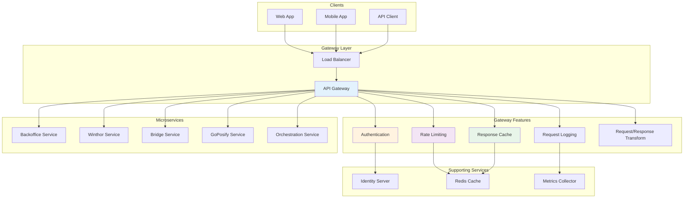

## Introdução

O Gateway Service é o ponto de entrada único (single entry point) para toda a plataforma NWERP. Ele atua como um API Gateway, fornecendo roteamento inteligente, autenticação, rate limiting, e outras funcionalidades transversais para todos os microserviços.

<CardGroup cols={2}>
  <Card title="Roteamento" icon="route">
    Roteamento inteligente de requisições
  </Card>
  <Card title="Autenticação" icon="shield">
    Auth centralizada com JWT
  </Card>
  <Card title="Rate Limiting" icon="gauge">
    Controle de taxa de requisições
  </Card>
  <Card title="Load Balancing" icon="scale-balanced">
    Balanceamento de carga
  </Card>
</CardGroup>

## Arquitetura

### Visão Geral



## Funcionalidades Principais

### 1. Roteamento de Requisições

O Gateway roteia requisições para os serviços apropriados baseado em regras configuráveis.

<Tabs>
  <Tab title="Configuração de Rotas">
    ```json
    {
      "Routes": [
        {
          "RouteId": "backoffice-route",
          "DownstreamPathTemplate": "/api/{everything}",
          "DownstreamScheme": "http",
          "DownstreamHostAndPorts": [
            {
              "Host": "backoffice-service",
              "Port": 80
            }
          ],
          "UpstreamPathTemplate": "/backoffice/{everything}",
          "UpstreamHttpMethod": [ "GET", "POST", "PUT", "DELETE" ],
          "AuthenticationOptions": {
            "AuthenticationProviderKey": "Bearer"
          }
        },
        {
          "RouteId": "winthor-route",
          "DownstreamPathTemplate": "/api/{everything}",
          "DownstreamScheme": "http",
          "DownstreamHostAndPorts": [
            {
              "Host": "winthor-service",
              "Port": 80
            }
          ],
          "UpstreamPathTemplate": "/winthor/{everything}",
          "UpstreamHttpMethod": [ "GET", "POST" ],
          "RateLimitOptions": {
            "ClientWhitelist": [],
            "EnableRateLimiting": true,
            "Period": "1m",
            "Limit": 100
          }
        },
        {
          "RouteId": "bridge-route",
          "DownstreamPathTemplate": "/api/{everything}",
          "DownstreamScheme": "http",
          "DownstreamHostAndPorts": [
            {
              "Host": "bridge-service",
              "Port": 80
            }
          ],
          "UpstreamPathTemplate": "/bridge/{everything}",
          "UpstreamHttpMethod": [ "GET", "POST" ]
        },
        {
          "RouteId": "goposify-route",
          "DownstreamPathTemplate": "/{everything}",
          "DownstreamScheme": "http",
          "DownstreamHostAndPorts": [
            {
              "Host": "goposify-service",
              "Port": 80
            }
          ],
          "UpstreamPathTemplate": "/pos/{everything}",
          "UpstreamHttpMethod": [ "GET", "POST", "PUT", "DELETE" ]
        }
      ]
    }
    ```
  </Tab>

  <Tab title="Load Balancing">
    ```json
    {
      "Routes": [
        {
          "RouteId": "winthor-lb",
          "DownstreamPathTemplate": "/api/{everything}",
          "DownstreamScheme": "http",
          "DownstreamHostAndPorts": [
            {
              "Host": "winthor-service-1",
              "Port": 80
            },
            {
              "Host": "winthor-service-2",
              "Port": 80
            },
            {
              "Host": "winthor-service-3",
              "Port": 80
            }
          ],
          "UpstreamPathTemplate": "/winthor/{everything}",
          "LoadBalancerOptions": {
            "Type": "RoundRobin"
          }
        }
      ]
    }
    ```
    
    **Tipos de Load Balancer:**
    - `LeastConnection` - Menos conexões ativas
    - `RoundRobin` - Rotação sequencial
    - `NoLoadBalancer` - Sem balanceamento
  </Tab>

  <Tab title="Service Discovery">
    ```csharp
    public class ServiceDiscoveryConfig
    {
        public void ConfigureServices(IServiceCollection services)
        {
            services
                .AddOcelot()
                .AddConsul()
                .AddConfigStoredInConsul();
            
            services.AddConsul(options =>
            {
                options.Address = new Uri("http://consul:8500");
            });
        }
    }
    ```
    
    **Recursos:**
    - Descoberta automática de serviços
    - Health checks
    - Failover automático
  </Tab>
</Tabs>

### 2. Autenticação e Autorização

<Tabs>
  <Tab title="JWT Authentication">
    ```csharp
    public class AuthenticationConfig
    {
        public void Configure(IServiceCollection services, 
            IConfiguration configuration)
        {
            services.AddAuthentication(JwtBearerDefaults.AuthenticationScheme)
                .AddJwtBearer(options =>
                {
                    options.Authority = configuration["Auth:Authority"];
                    options.Audience = configuration["Auth:Audience"];
                    options.RequireHttpsMetadata = true;
                    
                    options.TokenValidationParameters = new TokenValidationParameters
                    {
                        ValidateIssuer = true,
                        ValidateAudience = true,
                        ValidateLifetime = true,
                        ValidateIssuerSigningKey = true,
                        ClockSkew = TimeSpan.Zero
                    };
                });
            
            services.AddAuthorization(options =>
            {
                options.AddPolicy("AdminOnly", policy =>
                    policy.RequireClaim("role", "admin"));
                
                options.AddPolicy("TenantAccess", policy =>
                    policy.RequireClaim("tenant_id"));
            });
        }
    }
    ```
  </Tab>

  <Tab title="API Key Authentication">
    ```csharp
    public class ApiKeyMiddleware
    {
        private readonly RequestDelegate _next;
        private readonly IApiKeyService _apiKeyService;
        
        public async Task InvokeAsync(HttpContext context)
        {
            if (!context.Request.Headers.TryGetValue(
                "X-API-Key", out var apiKey))
            {
                context.Response.StatusCode = 401;
                await context.Response.WriteAsync("API Key is missing");
                return;
            }
            
            var isValid = await _apiKeyService
                .ValidateAsync(apiKey);
            
            if (!isValid)
            {
                context.Response.StatusCode = 401;
                await context.Response.WriteAsync("Invalid API Key");
                return;
            }
            
            // Adicionar informações do tenant ao contexto
            var tenant = await _apiKeyService
                .GetTenantByApiKeyAsync(apiKey);
            context.Items["TenantId"] = tenant.Id;
            
            await _next(context);
        }
    }
    ```
  </Tab>

  <Tab title="Multi-Tenant Isolation">
    ```csharp
    public class TenantIsolationMiddleware
    {
        private readonly RequestDelegate _next;
        
        public async Task InvokeAsync(HttpContext context)
        {
            // Extrair tenant do token JWT ou API Key
            var tenantId = ExtractTenantId(context);
            
            if (string.IsNullOrEmpty(tenantId))
            {
                context.Response.StatusCode = 400;
                await context.Response.WriteAsync("Tenant ID is required");
                return;
            }
            
            // Adicionar ao header downstream
            context.Request.Headers.Add("X-Tenant-Id", tenantId);
            
            // Validar acesso ao tenant
            if (!await _tenantService.HasAccessAsync(
                context.User.Identity.Name, tenantId))
            {
                context.Response.StatusCode = 403;
                await context.Response.WriteAsync("Access denied");
                return;
            }
            
            await _next(context);
        }
        
        private string ExtractTenantId(HttpContext context)
        {
            // Tentar extrair do JWT
            var claim = context.User
                .FindFirst("tenant_id")?.Value;
            
            if (!string.IsNullOrEmpty(claim))
                return claim;
            
            // Tentar extrair do contexto (API Key)
            if (context.Items.TryGetValue("TenantId", out var tenantId))
                return tenantId.ToString();
            
            return null;
        }
    }
    ```
  </Tab>
</Tabs>

### 3. Rate Limiting

Controle de taxa de requisições por cliente, endpoint ou tenant.

```csharp
public class RateLimitingConfig
{
    public void Configure(IServiceCollection services)
    {
        services.AddRateLimiter(options =>
        {
            // Rate limit global
            options.GlobalLimiter = PartitionedRateLimiter.Create<HttpContext, string>(
                httpContext =>
                {
                    var tenantId = httpContext.Items["TenantId"]?.ToString();
                    
                    return RateLimitPartition.GetFixedWindowLimiter(
                        partitionKey: tenantId ?? "anonymous",
                        factory: partition => new FixedWindowRateLimiterOptions
                        {
                            PermitLimit = 100,
                            Window = TimeSpan.FromMinutes(1),
                            QueueProcessingOrder = QueueProcessingOrder.OldestFirst,
                            QueueLimit = 2
                        });
                });
            
            // Rate limit por plano
            options.AddPolicy("basic-plan", httpContext =>
            {
                return RateLimitPartition.GetTokenBucketLimiter(
                    httpContext.User.Identity.Name,
                    partition => new TokenBucketRateLimiterOptions
                    {
                        TokenLimit = 1000,
                        ReplenishmentPeriod = TimeSpan.FromHours(1),
                        TokensPerPeriod = 1000,
                        AutoReplenishment = true
                    });
            });
            
            options.AddPolicy("premium-plan", httpContext =>
            {
                return RateLimitPartition.GetTokenBucketLimiter(
                    httpContext.User.Identity.Name,
                    partition => new TokenBucketRateLimiterOptions
                    {
                        TokenLimit = 10000,
                        ReplenishmentPeriod = TimeSpan.FromHours(1),
                        TokensPerPeriod = 10000,
                        AutoReplenishment = true
                    });
            });
            
            options.RejectionStatusCode = 429;
        });
    }
}
```

### 4. Caching

Sistema de cache inteligente para otimizar performance.

<CodeGroup>
```csharp Response Caching
public class ResponseCachingConfig
{
    public void Configure(IServiceCollection services)
    {
        services.AddResponseCaching();
        
        services.AddDistributedRedisCache(options =>
        {
            options.Configuration = "localhost:6379";
            options.InstanceName = "NwerpGateway:";
        });
    }
}

public class CachingMiddleware
{
    private readonly RequestDelegate _next;
    private readonly IDistributedCache _cache;
    
    public async Task InvokeAsync(HttpContext context)
    {
        if (context.Request.Method != "GET")
        {
            await _next(context);
            return;
        }
        
        var cacheKey = GenerateCacheKey(context.Request);
        var cachedResponse = await _cache.GetStringAsync(cacheKey);
        
        if (cachedResponse != null)
        {
            context.Response.ContentType = "application/json";
            context.Response.Headers.Add("X-Cache", "HIT");
            await context.Response.WriteAsync(cachedResponse);
            return;
        }
        
        // Capture response
        var originalBodyStream = context.Response.Body;
        using var responseBody = new MemoryStream();
        context.Response.Body = responseBody;
        
        await _next(context);
        
        // Cache successful responses
        if (context.Response.StatusCode == 200)
        {
            responseBody.Seek(0, SeekOrigin.Begin);
            var responseText = await new StreamReader(responseBody)
                .ReadToEndAsync();
            
            await _cache.SetStringAsync(
                cacheKey,
                responseText,
                new DistributedCacheEntryOptions
                {
                    AbsoluteExpirationRelativeToNow = TimeSpan.FromMinutes(5)
                });
            
            responseBody.Seek(0, SeekOrigin.Begin);
            context.Response.Headers.Add("X-Cache", "MISS");
        }
        
        await responseBody.CopyToAsync(originalBodyStream);
    }
}
```

```csharp Cache Invalidation
public class CacheInvalidationService
{
    private readonly IDistributedCache _cache;
    private readonly IEventBus _eventBus;
    
    public async Task InvalidateAsync(string pattern)
    {
        // Invalidar cache por padrão
        await _cache.RemoveAsync(pattern);
        
        // Publicar evento para outros gateways
        await _eventBus.PublishAsync(new CacheInvalidatedEvent
        {
            Pattern = pattern,
            Timestamp = DateTime.UtcNow
        });
    }
    
    public async Task InvalidateTenantCacheAsync(string tenantId)
    {
        await InvalidateAsync($"*tenant:{tenantId}*");
    }
    
    public async Task InvalidateResourceCacheAsync(
        string resource, 
        string id)
    {
        await InvalidateAsync($"*{resource}:{id}*");
    }
}
```
</CodeGroup>

### 5. Request/Response Transformation

<Tabs>
  <Tab title="Request Transform">
    ```csharp
    public class RequestTransformMiddleware
    {
        private readonly RequestDelegate _next;
        
        public async Task InvokeAsync(HttpContext context)
        {
            // Adicionar headers padrão
            context.Request.Headers.Add("X-Request-Id", Guid.NewGuid().ToString());
            context.Request.Headers.Add("X-Forwarded-For", context.Connection.RemoteIpAddress?.ToString());
            
            // Extrair e adicionar tenant
            var tenantId = context.Items["TenantId"]?.ToString();
            if (!string.IsNullOrEmpty(tenantId))
            {
                context.Request.Headers.Add("X-Tenant-Id", tenantId);
            }
            
            // Adicionar correlationId
            var correlationId = context.Request.Headers["X-Correlation-Id"].FirstOrDefault()
                ?? Guid.NewGuid().ToString();
            context.Request.Headers.Add("X-Correlation-Id", correlationId);
            
            await _next(context);
        }
    }
    ```
  </Tab>

  <Tab title="Response Transform">
    ```csharp
    public class ResponseTransformMiddleware
    {
        private readonly RequestDelegate _next;
        
        public async Task InvokeAsync(HttpContext context)
        {
            var originalBodyStream = context.Response.Body;
            
            using var responseBody = new MemoryStream();
            context.Response.Body = responseBody;
            
            await _next(context);
            
            // Transformar resposta
            responseBody.Seek(0, SeekOrigin.Begin);
            var body = await new StreamReader(responseBody).ReadToEndAsync();
            
            var transformed = TransformResponse(body, context);
            
            // Adicionar headers customizados
            context.Response.Headers.Add("X-Response-Time", 
                $"{DateTime.UtcNow:O}");
            context.Response.Headers.Add("X-Gateway-Version", "1.0.0");
            
            // Escrever resposta transformada
            var bytes = Encoding.UTF8.GetBytes(transformed);
            context.Response.Body = originalBodyStream;
            await context.Response.Body.WriteAsync(bytes);
        }
        
        private string TransformResponse(string body, HttpContext context)
        {
            // Adicionar envelope padrão
            var response = new
            {
                success = context.Response.StatusCode < 400,
                data = JsonSerializer.Deserialize<object>(body),
                timestamp = DateTime.UtcNow,
                requestId = context.Request.Headers["X-Request-Id"].ToString()
            };
            
            return JsonSerializer.Serialize(response);
        }
    }
    ```
  </Tab>
</Tabs>

## Monitoramento e Observabilidade

### Métricas

```csharp
// Requisições por segundo
var requestsPerSecond = Metrics.CreateCounter(
    "gateway_requests_total",
    "Total de requisições",
    new CounterConfiguration
    {
        LabelNames = new[] { "method", "route", "status_code" }
    });

// Latência
var latency = Metrics.CreateHistogram(
    "gateway_request_duration_seconds",
    "Duração das requisições");

// Erros
var errors = Metrics.CreateCounter(
    "gateway_errors_total",
    "Total de erros");
```

### Distributed Tracing

```csharp
services.AddOpenTelemetry()
    .WithTracing(builder =>
    {
        builder
            .AddAspNetCoreInstrumentation()
            .AddHttpClientInstrumentation()
            .AddOtlpExporter(options =>
            {
                options.Endpoint = new Uri("http://jaeger:4317");
            });
    });
```

## Configuração

### appsettings.json

```json
{
  "Gateway": {
    "BaseUrl": "https://api.nwerp.com",
    "Timeout": 30,
    "EnableCaching": true,
    "EnableRateLimiting": true
  },
  "RateLimiting": {
    "DefaultLimit": 100,
    "DefaultWindow": "1m",
    "BypassApiKeys": []
  },
  "Cache": {
    "DefaultExpiration": 300,
    "Redis": {
      "ConnectionString": "localhost:6379",
      "InstanceName": "NwerpGateway:"
    }
  },
  "Authentication": {
    "Authority": "https://identity.nwerp.com",
    "Audience": "nwerp-api",
    "RequireHttpsMetadata": true
  },
  "ServiceDiscovery": {
    "Consul": {
      "Host": "consul",
      "Port": 8500
    }
  }
}
```

## Deployment

### Docker Compose

```yaml
services:
  gateway:
    image: nwerp/gateway:latest
    ports:
      - "80:80"
      - "443:443"
    environment:
      - ASPNETCORE_ENVIRONMENT=Production
      - ConnectionStrings__Redis=redis:6379
      - ServiceDiscovery__Consul__Host=consul
    depends_on:
      - redis
      - consul
    restart: unless-stopped
    deploy:
      replicas: 3
```

## Próximos Passos

<CardGroup cols={2}>
  <Card title="Autenticação" icon="shield" href="/nwerp/guides/authentication">
    Guia de autenticação
  </Card>
  <Card title="Rate Limiting" icon="gauge" href="/nwerp/guides/rate-limiting">
    Configurar limites
  </Card>
  <Card title="Deployment" icon="server" href="/nwerp/deployment/infrastructure">
    Deploy do Gateway
  </Card>
  <Card title="Monitoramento" icon="chart-line" href="/nwerp/guides/monitoring">
    Monitorar o Gateway
  </Card>
</CardGroup>

