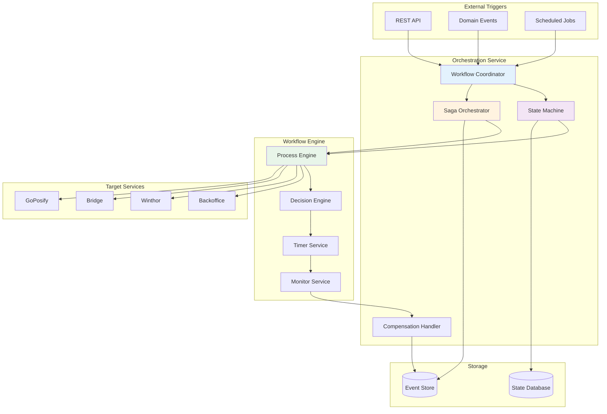
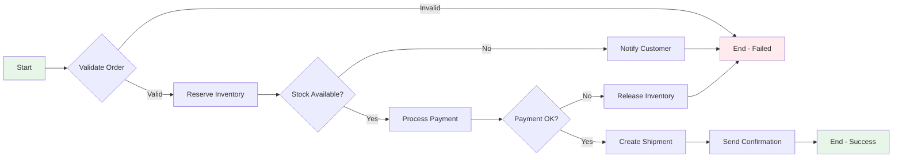

## Introdução

O Orchestration Service é responsável por coordenar e orquestrar workflows complexos entre os diversos microserviços do ecossistema NWERP. Ele atua como um maestro, garantindo que processos de negócio que envolvem múltiplos serviços sejam executados de forma consistente e confiável.

<CardGroup cols={2}>
  <Card title="Workflows" icon="sitemap">
    Orquestração de processos complexos
  </Card>
  <Card title="Saga Pattern" icon="arrows-rotate">
    Transações distribuídas
  </Card>
  <Card title="Event Coordination" icon="timeline">
    Coordenação de eventos
  </Card>
  <Card title="State Management" icon="database">
    Gerenciamento de estado
  </Card>
</CardGroup>

## Arquitetura

### Visão Geral



### Estrutura de Projetos

<AccordionGroup>
  <Accordion title="NWERP.Orchestration.AppHost" icon="server">
    **Camada de Apresentação** - API REST e configuração
    
    **Componentes:**
    - Controllers - Endpoints REST
    - Configuration - Setup de serviços
    - Middleware - Pipeline de requisições
    - Jobs - Tarefas agendadas
  </Accordion>

  <Accordion title="NWERP.Orchestration.Application" icon="cogs">
    **Camada de Aplicação** - Lógica de orquestração
    
    - WorkflowServices - Serviços de workflow
    - SagaOrchestrators - Orquestradores de saga
    - Handlers - Manipuladores de eventos
    - UseCases - Casos de uso
  </Accordion>

  <Accordion title="NWERP.Orchestration.Contracts" icon="file-contract">
    **Contratos** - Interfaces e DTOs
    
    - IWorkflowService - Interface de workflow
    - ISagaOrchestrator - Interface de saga
    - WorkflowDefinitions - Definições de workflows
    - Commands & Events - CQRS
  </Accordion>

  <Accordion title="NWERP.Orchestration.Domain" icon="cube">
    **Camada de Domínio**
    
    - Workflow - Entidade de workflow
    - WorkflowInstance - Instância de execução
    - WorkflowStep - Passos do workflow
    - SagaState - Estado da saga
  </Accordion>

  <Accordion title="NWERP.Orchestration.Infrastructure" icon="toolbox">
    **Infraestrutura**
    
    - Persistence - Repositórios
    - Messaging - RabbitMQ adapters
    - External Services - Clients HTTP
    - State Management - Redis
  </Accordion>

  <Accordion title="NWERP.Orchestration.Data.TenantDatabase" icon="database">
    **Acesso a Dados**
    
    - DbContext - Contexto EF Core
    - Repositories - Implementações
    - Migrations - Migrações
  </Accordion>
</AccordionGroup>

## Conceitos Principais

### Workflows

Workflows definem sequências de ações que devem ser executadas para completar um processo de negócio.



**Exemplo de Definição de Workflow:**

```csharp
public class OrderProcessingWorkflow : IWorkflowDefinition
{
    public string Name => "OrderProcessing";
    public string Version => "1.0";
    
    public void Configure(IWorkflowBuilder builder)
    {
        builder
            .StartsWith<ValidateOrderStep>()
            .Then<ReserveInventoryStep>()
            .Then<ProcessPaymentStep>()
            .Then<CreateShipmentStep>()
            .Then<SendConfirmationStep>()
            .OnError<CompensateOrderStep>();
    }
}

public class ValidateOrderStep : IWorkflowStep
{
    private readonly IOrderValidator _validator;
    
    public async Task<ExecutionResult> ExecuteAsync(
        WorkflowContext context)
    {
        var order = context.GetData<Order>();
        var isValid = await _validator.ValidateAsync(order);
        
        return isValid 
            ? ExecutionResult.Success() 
            : ExecutionResult.Failed("Invalid order");
    }
}
```

### Saga Pattern

O padrão Saga é usado para gerenciar transações distribuídas através de múltiplos serviços.

<Tabs>
  <Tab title="Orchestrated Saga">
    ```csharp
    public class OrderSagaOrchestrator : ISagaOrchestrator
    {
        private readonly IBackofficeClient _backoffice;
        private readonly IWinthorClient _winthor;
        private readonly IInventoryClient _inventory;
        
        public async Task<SagaResult> ExecuteAsync(
            OrderSagaData data)
        {
            var sagaId = Guid.NewGuid();
            var state = new SagaState(sagaId);
            
            try
            {
                // Step 1: Reserve inventory
                var reservationId = await _inventory
                    .ReserveAsync(data.Items);
                state.RecordStep("ReserveInventory", reservationId);
                
                // Step 2: Create order in Winthor
                var orderId = await _winthor
                    .CreateOrderAsync(data.Order);
                state.RecordStep("CreateOrder", orderId);
                
                // Step 3: Process payment
                var paymentId = await _backoffice
                    .ProcessPaymentAsync(data.Payment);
                state.RecordStep("ProcessPayment", paymentId);
                
                // Step 4: Confirm order
                await _winthor.ConfirmOrderAsync(orderId);
                state.Complete();
                
                return SagaResult.Success(state);
            }
            catch (Exception ex)
            {
                // Compensate in reverse order
                await CompensateAsync(state);
                return SagaResult.Failed(ex.Message);
            }
        }
        
        private async Task CompensateAsync(SagaState state)
        {
            var steps = state.GetCompletedSteps().Reverse();
            
            foreach (var step in steps)
            {
                switch (step.Name)
                {
                    case "ProcessPayment":
                        await _backoffice.RefundPaymentAsync(
                            step.Data["paymentId"]);
                        break;
                        
                    case "CreateOrder":
                        await _winthor.CancelOrderAsync(
                            step.Data["orderId"]);
                        break;
                        
                    case "ReserveInventory":
                        await _inventory.ReleaseReservationAsync(
                            step.Data["reservationId"]);
                        break;
                }
            }
        }
    }
    ```
  </Tab>

  <Tab title="Saga State">
    ```csharp
    public class SagaState
    {
        public Guid SagaId { get; }
        public string Status { get; private set; }
        public DateTime StartedAt { get; }
        public DateTime? CompletedAt { get; private set; }
        public List<SagaStep> Steps { get; }
        
        public SagaState(Guid sagaId)
        {
            SagaId = sagaId;
            Status = "Started";
            StartedAt = DateTime.UtcNow;
            Steps = new List<SagaStep>();
        }
        
        public void RecordStep(string name, object data)
        {
            Steps.Add(new SagaStep
            {
                Name = name,
                Data = data,
                ExecutedAt = DateTime.UtcNow,
                Status = "Completed"
            });
        }
        
        public void Complete()
        {
            Status = "Completed";
            CompletedAt = DateTime.UtcNow;
        }
        
        public void Fail(string reason)
        {
            Status = "Failed";
            CompletedAt = DateTime.UtcNow;
        }
        
        public IEnumerable<SagaStep> GetCompletedSteps()
        {
            return Steps.Where(s => s.Status == "Completed");
        }
    }
    
    public class SagaStep
    {
        public string Name { get; set; }
        public object Data { get; set; }
        public DateTime ExecutedAt { get; set; }
        public string Status { get; set; }
    }
    ```
  </Tab>

  <Tab title="Compensation">
    ```csharp
    public interface ICompensationHandler
    {
        Task CompensateAsync(SagaStep step);
    }
    
    public class InventoryCompensationHandler 
        : ICompensationHandler
    {
        private readonly IInventoryClient _client;
        
        public async Task CompensateAsync(SagaStep step)
        {
            var reservationId = step.Data["reservationId"];
            
            await _client.ReleaseReservationAsync(
                reservationId);
            
            // Log compensation
            _logger.LogInformation(
                "Compensated inventory reservation {ReservationId}",
                reservationId);
        }
    }
    ```
  </Tab>
</Tabs>

## Workflows Pré-definidos

O Orchestration Service vem com diversos workflows prontos para casos de uso comuns.

<AccordionGroup>
  <Accordion title="Order Processing Workflow" icon="cart-shopping">
    **Fluxo de Processamento de Pedidos**
    
    1. Validar pedido
    2. Verificar estoque
    3. Reservar itens
    4. Processar pagamento
    5. Criar nota fiscal
    6. Gerar remessa
    7. Enviar notificações
    
    **Compensações:**
    - Estornar pagamento
    - Liberar reserva
    - Cancelar nota fiscal
  </Accordion>

  <Accordion title="Inventory Sync Workflow" icon="warehouse">
    **Fluxo de Sincronização de Estoque**
    
    1. Extrair dados do Winthor
    2. Transformar formato
    3. Validar dados
    4. Atualizar PostgreSQL
    5. Publicar eventos de mudança
    6. Atualizar cache
    
    **Compensações:**
    - Reverter alterações
    - Restaurar estado anterior
  </Accordion>

  <Accordion title="Customer Onboarding Workflow" icon="user-plus">
    **Fluxo de Cadastro de Cliente**
    
    1. Validar documentos
    2. Verificar crédito
    3. Criar tenant
    4. Alocar recursos
    5. Configurar banco de dados
    6. Enviar credenciais
    7. Agendar treinamento
    
    **Compensações:**
    - Remover tenant
    - Liberar recursos
    - Cancelar cadastro
  </Accordion>

  <Accordion title="Invoice Generation Workflow" icon="file-invoice">
    **Fluxo de Geração de Nota Fiscal**
    
    1. Validar dados fiscais
    2. Calcular impostos
    3. Gerar XML NFe
    4. Assinar digitalmente
    5. Transmitir para SEFAZ
    6. Aguardar autorização
    7. Enviar para cliente
    
    **Compensações:**
    - Cancelar NFe
    - Notificar erro
  </Accordion>
</AccordionGroup>

## API Endpoints

### Workflow Management

<CodeGroup>
```bash Iniciar Workflow
POST /api/workflows/start
Content-Type: application/json

{
  "workflowName": "OrderProcessing",
  "version": "1.0",
  "data": {
    "orderId": "ORD-12345",
    "customerId": "CUST-678",
    "items": [...]
  },
  "correlationId": "unique-id"
}
```

```bash Status do Workflow
GET /api/workflows/{instanceId}/status

Response:
{
  "instanceId": "uuid",
  "workflowName": "OrderProcessing",
  "status": "Running",
  "currentStep": "ProcessPayment",
  "startedAt": "2025-11-16T10:00:00Z",
  "progress": 60
}
```

```bash Cancelar Workflow
POST /api/workflows/{instanceId}/cancel

Response:
{
  "instanceId": "uuid",
  "status": "Cancelling",
  "message": "Workflow cancellation initiated"
}
```
</CodeGroup>

### Saga Management

<CodeGroup>
```bash Executar Saga
POST /api/sagas/execute
Content-Type: application/json

{
  "sagaType": "OrderSaga",
  "data": {
    "order": {...},
    "payment": {...},
    "shipping": {...}
  }
}
```

```bash Status da Saga
GET /api/sagas/{sagaId}/status

Response:
{
  "sagaId": "uuid",
  "status": "Completed",
  "steps": [
    {
      "name": "ReserveInventory",
      "status": "Completed",
      "executedAt": "2025-11-16T10:00:00Z"
    },
    ...
  ]
}
```
</CodeGroup>

## Event-Driven Coordination

O Orchestration Service coordena eventos entre serviços.

```csharp
public class OrderEventCoordinator : IEventCoordinator
{
    private readonly IEventBus _eventBus;
    private readonly IWorkflowEngine _workflowEngine;
    
    public async Task HandleAsync(OrderCreatedEvent @event)
    {
        // Iniciar workflow de processamento
        await _workflowEngine.StartAsync(
            "OrderProcessing",
            new { orderId = @event.OrderId });
        
        // Publicar evento de início
        await _eventBus.PublishAsync(
            new OrderProcessingStartedEvent
            {
                OrderId = @event.OrderId,
                WorkflowInstanceId = workflowInstance.Id
            });
    }
    
    public async Task HandleAsync(PaymentProcessedEvent @event)
    {
        // Notificar workflow
        await _workflowEngine.SignalAsync(
            @event.WorkflowInstanceId,
            "PaymentCompleted",
            @event);
    }
}
```

## Monitoramento

### Métricas

```csharp
// Workflows ativos
var activeWorkflows = Metrics.CreateGauge(
    "orchestration_active_workflows",
    "Número de workflows ativos");

// Taxa de sucesso
var successRate = Metrics.CreateGauge(
    "orchestration_success_rate",
    "Taxa de sucesso dos workflows");

// Duração média
var avgDuration = Metrics.CreateHistogram(
    "orchestration_workflow_duration_seconds",
    "Duração dos workflows");
```

### Health Checks

```csharp
builder.Services.AddHealthChecks()
    .AddCheck<WorkflowEngineHealthCheck>("workflow-engine")
    .AddCheck<SagaStateHealthCheck>("saga-state")
    .AddNpgSql(connectionString, name: "database");
```

## Próximos Passos

<CardGroup cols={2}>
  <Card title="Backoffice" icon="building" href="/nwerp/components/backoffice">
    Serviço Backoffice
  </Card>
  <Card title="Bridge" icon="bridge" href="/nwerp/components/bridge">
    Serviço Bridge
  </Card>
  <Card title="Deployment" icon="server" href="/nwerp/deployment/infrastructure">
    Guias de deployment
  </Card>
  <Card title="Arquitetura" icon="sitemap" href="/nwerp/architecture/overview">
    Visão geral da arquitetura
  </Card>
</CardGroup>

