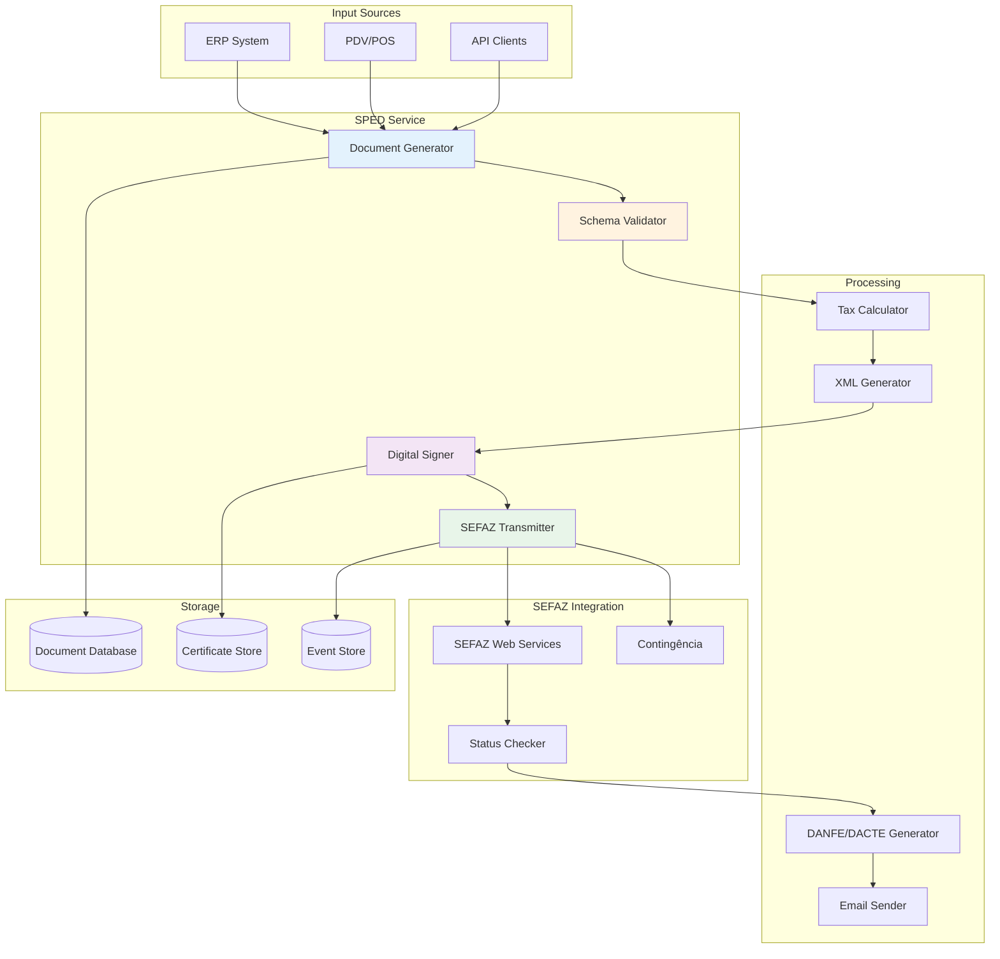

## Introdução

O SPED Service é responsável por toda a geração, validação e transmissão de documentos fiscais eletrônicos conforme as normas da legislação brasileira. Ele gerencia NF-e, NFC-e, CT-e, MDF-e, SPED Fiscal, SPED Contribuições e outros documentos do Sistema Público de Escrituração Digital.

<CardGroup cols={2}>
  <Card title="NF-e / NFC-e" icon="receipt">
    Notas Fiscais Eletrônicas
  </Card>
  <Card title="CT-e / MDF-e" icon="truck">
    Documentos de Transporte
  </Card>
  <Card title="SPED Fiscal" icon="file-lines">
    Escrituração Fiscal Digital
  </Card>
  <Card title="SPED Contribuições" icon="coins">
    PIS/COFINS Digital
  </Card>
</CardGroup>

## Arquitetura

### Visão Geral



## Funcionalidades Principais

### 1. NF-e (Nota Fiscal Eletrônica)

Geração e transmissão de Notas Fiscais Eletrônicas.

<Tabs>
  <Tab title="Geração">
    ```csharp
    public class NFeService
    {
        private readonly ITaxCalculator _taxCalculator;
        private readonly IXmlGenerator _xmlGenerator;
        private readonly IDigitalSigner _signer;
        
        public async Task<NFeResult> GerarNFeAsync(NFeRequest request)
        {
            // 1. Validar dados
            var validation = await ValidateAsync(request);
            if (!validation.IsValid)
                return NFeResult.Failed(validation.Errors);
            
            // 2. Calcular impostos
            var taxData = await _taxCalculator.CalculateAsync(request);
            
            // 3. Gerar XML
            var xml = _xmlGenerator.Generate(request, taxData);
            
            // 4. Validar schema
            var schemaValidation = await ValidateSchemaAsync(xml);
            if (!schemaValidation.IsValid)
                return NFeResult.Failed(schemaValidation.Errors);
            
            // 5. Assinar digitalmente
            var signedXml = await _signer.SignAsync(xml, request.CertificateId);
            
            // 6. Salvar no banco
            var nfe = await _repository.SaveAsync(new NFe
            {
                ChaveAcesso = ExtractChaveAcesso(signedXml),
                Numero = request.Numero,
                Serie = request.Serie,
                Xml = signedXml,
                Status = NFeStatus.Gerada,
                DataEmissao = DateTime.Now
            });
            
            return NFeResult.Success(nfe);
        }
    }
    ```
  </Tab>

  <Tab title="Transmissão">
    ```csharp
    public class NFeTransmitter
    {
        private readonly ISefazClient _sefazClient;
        private readonly IContingencyManager _contingency;
        
        public async Task<TransmissionResult> TransmitirAsync(NFe nfe)
        {
            try
            {
                // Verificar status do serviço SEFAZ
                var sefazStatus = await _sefazClient.ConsultarStatusAsync(nfe.UF);
                
                if (!sefazStatus.Online)
                {
                    // Ativar contingência
                    return await _contingency.EmitirEmContingenciaAsync(nfe);
                }
                
                // Transmitir para SEFAZ
                var lote = new LoteNFe
                {
                    IdLote = GenerateLoteId(),
                    NFes = new[] { nfe }
                };
                
                var response = await _sefazClient.EnviarLoteAsync(lote);
                
                if (response.CodStatus == "103") // Lote recebido
                {
                    // Aguardar processamento
                    await Task.Delay(TimeSpan.FromSeconds(5));
                    
                    // Consultar recibo
                    var recibo = await _sefazClient
                        .ConsultarReciboAsync(response.NumeroRecibo);
                    
                    if (recibo.CodStatus == "100") // Autorizada
                    {
                        await _repository.UpdateStatusAsync(
                            nfe.Id,
                            NFeStatus.Autorizada,
                            recibo.Protocolo);
                        
                        // Gerar DANFE
                        await GenerateDanfeAsync(nfe, recibo.Protocolo);
                        
                        // Enviar por email
                        await SendEmailAsync(nfe);
                        
                        return TransmissionResult.Success(recibo);
                    }
                }
                
                return TransmissionResult.Failed(response.Mensagem);
            }
            catch (SefazException ex)
            {
                _logger.LogError(ex, "Erro ao transmitir NF-e {ChaveAcesso}", 
                    nfe.ChaveAcesso);
                return TransmissionResult.Failed(ex.Message);
            }
        }
    }
    ```
  </Tab>

  <Tab title="Eventos">
    ```csharp
    public class NFeEventService
    {
        public async Task<EventResult> CancelarAsync(
            string chaveAcesso, 
            string justificativa)
        {
            // Validar justificativa (mínimo 15 caracteres)
            if (justificativa.Length < 15)
                return EventResult.Failed("Justificativa muito curta");
            
            var nfe = await _repository.GetByChaveAcessoAsync(chaveAcesso);
            
            // Gerar evento de cancelamento
            var evento = new EventoNFe
            {
                TipoEvento = TipoEvento.Cancelamento,
                ChaveAcesso = chaveAcesso,
                Sequencia = 1,
                Justificativa = justificativa,
                DataEvento = DateTime.Now
            };
            
            var xml = _xmlGenerator.GenerateEvento(evento);
            var signedXml = await _signer.SignAsync(xml);
            
            // Transmitir evento
            var response = await _sefazClient.EnviarEventoAsync(signedXml);
            
            if (response.CodStatus == "135") // Evento registrado
            {
                await _repository.UpdateStatusAsync(
                    nfe.Id,
                    NFeStatus.Cancelada);
                
                await _eventRepository.SaveAsync(evento);
                
                return EventResult.Success(response);
            }
            
            return EventResult.Failed(response.Mensagem);
        }
        
        public async Task<EventResult> CartaCorrecaoAsync(
            string chaveAcesso,
            string correcao,
            int sequencia)
        {
            var evento = new EventoNFe
            {
                TipoEvento = TipoEvento.CartaCorrecao,
                ChaveAcesso = chaveAcesso,
                Sequencia = sequencia,
                Correcao = correcao,
                DataEvento = DateTime.Now
            };
            
            var xml = _xmlGenerator.GenerateEvento(evento);
            var signedXml = await _signer.SignAsync(xml);
            
            var response = await _sefazClient.EnviarEventoAsync(signedXml);
            
            if (response.CodStatus == "135")
            {
                await _eventRepository.SaveAsync(evento);
                return EventResult.Success(response);
            }
            
            return EventResult.Failed(response.Mensagem);
        }
    }
    ```
  </Tab>
</Tabs>

### 2. Cálculo de Impostos

Motor de cálculo de impostos brasileiros complexos.

<AccordionGroup>
  <Accordion title="ICMS" icon="landmark">
    **Imposto sobre Circulação de Mercadorias e Serviços**
    
    ```csharp
    public class IcmsCalculator
    {
        public IcmsData Calculate(CalculationInput input)
        {
            var result = new IcmsData();
            
            // ICMS Normal
            if (input.Cst == "00") // Tributado integralmente
            {
                result.BaseCalculo = input.ValorProduto;
                result.Valor = result.BaseCalculo * (input.Aliquota / 100);
                result.Aliquota = input.Aliquota;
            }
            
            // ICMS ST (Substituição Tributária)
            else if (input.Cst == "10")
            {
                result.BaseCalculo = input.ValorProduto;
                result.Valor = result.BaseCalculo * (input.Aliquota / 100);
                
                // Calcular ICMS ST
                result.BaseCalculoST = input.ValorProduto * (1 + (input.MVA / 100));
                result.ValorST = (result.BaseCalculoST * (input.AliquotaST / 100)) - result.Valor;
            }
            
            // ICMS Desonerado
            else if (input.Cst == "40" || input.Cst == "41")
            {
                result.Valor = 0;
                result.MotivoDesoneracao = input.MotivoDesoneracao;
            }
            
            return result;
        }
    }
    ```
  </Accordion>

  <Accordion title="IPI" icon="industry">
    **Imposto sobre Produtos Industrializados**
    
    ```csharp
    public class IpiCalculator
    {
        public IpiData Calculate(CalculationInput input)
        {
            if (input.CstIpi == "00" || input.CstIpi == "49") // Tributado
            {
                return new IpiData
                {
                    BaseCalculo = input.ValorProduto,
                    Aliquota = input.AliquotaIpi,
                    Valor = input.ValorProduto * (input.AliquotaIpi / 100)
                };
            }
            
            return new IpiData { Valor = 0 };
        }
    }
    ```
  </Accordion>

  <Accordion title="PIS/COFINS" icon="coins">
    **Contribuições Sociais**
    
    ```csharp
    public class PisCofinsCalculator
    {
        public PisCofinsData Calculate(CalculationInput input)
        {
            var result = new PisCofinsData();
            
            // PIS
            if (input.CstPis == "01") // Tributado com alíquota básica
            {
                result.PisBaseCalculo = input.ValorProduto;
                result.PisAliquota = 1.65m;
                result.PisValor = result.PisBaseCalculo * (result.PisAliquota / 100);
            }
            
            // COFINS
            if (input.CstCofins == "01") // Tributado com alíquota básica
            {
                result.CofinsBaseCalculo = input.ValorProduto;
                result.CofinsAliquota = 7.6m;
                result.CofinsValor = result.CofinsBaseCalculo * (result.CofinsAliquota / 100);
            }
            
            return result;
        }
    }
    ```
  </Accordion>
</AccordionGroup>

### 3. DANFE (Documento Auxiliar da Nota Fiscal Eletrônica)

Geração de PDF do DANFE.

```csharp
public class DanfeGenerator
{
    public async Task<byte[]> GenerateAsync(NFe nfe, string protocolo)
    {
        using var document = new PdfDocument();
        var page = document.AddPage();
        page.Size = PageSize.A4;
        
        using var gfx = XGraphics.FromPdfPage(page);
        var font = new XFont("Arial", 8);
        var fontBold = new XFont("Arial", 8, XFontStyle.Bold);
        
        // Cabeçalho
        DrawHeader(gfx, nfe, font, fontBold);
        
        // Identificação do Emitente
        DrawEmitente(gfx, nfe.Emitente, font, fontBold);
        
        // Destinatário
        DrawDestinatario(gfx, nfe.Destinatario, font, fontBold);
        
        // Produtos
        DrawProdutos(gfx, nfe.Produtos, font, fontBold);
        
        // Totais
        DrawTotais(gfx, nfe.Totais, font, fontBold);
        
        // Dados adicionais
        DrawDadosAdicionais(gfx, nfe.InformacoesAdicionais, font);
        
        // QR Code (para NFC-e)
        if (nfe.Modelo == "65")
        {
            DrawQRCode(gfx, nfe.QRCode);
        }
        
        // Código de barras
        DrawBarCode(gfx, nfe.ChaveAcesso);
        
        // Protocolo de autorização
        DrawProtocolo(gfx, protocolo, font);
        
        using var stream = new MemoryStream();
        document.Save(stream);
        return stream.ToArray();
    }
}
```

### 4. Contingência

Modos de contingência para indisponibilidade da SEFAZ.

<Tabs>
  <Tab title="FS-DA (Offline)">
    ```csharp
    public class FsDAContingency : IContingencyMode
    {
        public async Task<NFeResult> EmitirAsync(NFe nfe)
        {
            // Formular Segurança - Documento Auxiliar
            nfe.TipoEmissao = TipoEmissao.FSDA;
            nfe.Status = NFeStatus.ContingenciaFSDA;
            
            // Assinar com tipo de emissão 5
            var xml = _xmlGenerator.Generate(nfe);
            var signedXml = await _signer.SignAsync(xml);
            
            // Salvar para transmissão posterior
            await _repository.SaveAsync(nfe);
            
            // Gerar DANFE em contingência
            var danfe = await _danfeGenerator.GenerateAsync(nfe, null);
            
            // Agendar transmissão quando SEFAZ voltar
            await _scheduler.ScheduleTransmissionAsync(nfe.Id);
            
            return NFeResult.Success(nfe);
        }
    }
    ```
  </Tab>

  <Tab title="SVC (SEFAZ Virtual)">
    ```csharp
    public class SvcContingency : IContingencyMode
    {
        public async Task<NFeResult> EmitirAsync(NFe nfe)
        {
            // SEFAZ Virtual de Contingência
            nfe.TipoEmissao = TipoEmissao.SVC;
            
            var xml = _xmlGenerator.Generate(nfe);
            var signedXml = await _signer.SignAsync(xml);
            
            // Transmitir para SVC
            var svcClient = _sefazClientFactory.CreateSvcClient(nfe.UF);
            var response = await svcClient.EnviarLoteAsync(new LoteNFe
            {
                IdLote = GenerateLoteId(),
                NFes = new[] { nfe }
            });
            
            if (response.CodStatus == "103")
            {
                var recibo = await svcClient.ConsultarReciboAsync(response.NumeroRecibo);
                
                if (recibo.CodStatus == "100")
                {
                    await _repository.UpdateStatusAsync(
                        nfe.Id,
                        NFeStatus.AutorizadaSVC,
                        recibo.Protocolo);
                    
                    return NFeResult.Success(nfe);
                }
            }
            
            return NFeResult.Failed(response.Mensagem);
        }
    }
    ```
  </Tab>
</Tabs>

### 5. SPED Fiscal (EFD-ICMS/IPI)

Escrituração Fiscal Digital.

```csharp
public class SpedFiscalGenerator
{
    public async Task<string> GerarArquivoAsync(
        string cnpj,
        DateTime dataInicial,
        DateTime dataFinal)
    {
        var builder = new SpedBuilder();
        
        // Bloco 0: Abertura e Identificação
        builder.AddRegistro0000(cnpj, dataInicial, dataFinal);
        builder.AddRegistro0001();
        builder.AddRegistro0005(cnpj); // Dados complementares
        builder.AddRegistro0015(); // Dados do contribuinte substituto
        
        // Bloco C: Documentos Fiscais
        var notas = await _nfeRepository.GetByPeriodoAsync(dataInicial, dataFinal);
        foreach (var nota in notas)
        {
            builder.AddRegistroC100(nota); // Nota fiscal
            
            foreach (var item in nota.Itens)
            {
                builder.AddRegistroC170(item); // Itens da nota
                builder.AddRegistroC190(item); // Agregação por CST
            }
        }
        
        // Bloco E: Apuração do ICMS e IPI
        var apuracao = await _apuracaoService.CalcularAsync(dataInicial, dataFinal);
        builder.AddRegistroE100(apuracao.Icms);
        builder.AddRegistroE200(apuracao.Ipi);
        
        // Bloco H: Inventário
        if (IsUltimoDiaMes(dataFinal))
        {
            var estoque = await _estoqueRepository.GetEstoqueAsync(dataFinal);
            builder.AddRegistroH005(estoque);
        }
        
        // Bloco 9: Controle e Encerramento
        builder.AddBloco9();
        
        return builder.ToString();
    }
}
```

## API Endpoints

### NF-e

<CodeGroup>
```bash Emitir NF-e
POST /api/nfe/emitir
Content-Type: application/json

{
  "numero": 12345,
  "serie": 1,
  "emitente": {...},
  "destinatario": {...},
  "produtos": [...],
  "totais": {...}
}
```

```bash Consultar NF-e
GET /api/nfe/{chaveAcesso}

Response:
{
  "chaveAcesso": "35210912345678000190550010000123451000123456",
  "numero": 12345,
  "serie": 1,
  "status": "Autorizada",
  "protocolo": "135210000000001",
  "dataAutorizacao": "2021-09-15T10:30:00Z"
}
```

```bash Cancelar NF-e
POST /api/nfe/{chaveAcesso}/cancelar
Content-Type: application/json

{
  "justificativa": "Erro no cadastro do produto"
}
```

```bash Download DANFE
GET /api/nfe/{chaveAcesso}/danfe

Response: application/pdf
```
</CodeGroup>

## Certificados Digitais

Gerenciamento de certificados A1 (arquivo) e A3 (token/smart card).

```csharp
public class CertificateService
{
    public async Task<Certificate> InstallAsync(
        CertificateInstallRequest request)
    {
        X509Certificate2 cert;
        
        if (request.Type == CertificateType.A1)
        {
            // Certificado A1 (arquivo PFX)
            cert = new X509Certificate2(
                request.FileBytes,
                request.Password,
                X509KeyStorageFlags.Exportable);
        }
        else
        {
            // Certificado A3 (token/smartcard)
            var store = new X509Store(StoreName.My, StoreLocation.CurrentUser);
            store.Open(OpenFlags.ReadOnly);
            
            cert = store.Certificates
                .Find(X509FindType.FindBySerialNumber, request.SerialNumber, false)
                .FirstOrDefault();
            
            store.Close();
        }
        
        if (cert == null)
            throw new InvalidOperationException("Certificado não encontrado");
        
        // Validar validade
        if (DateTime.Now > cert.NotAfter)
            throw new InvalidOperationException("Certificado expirado");
        
        // Salvar no banco
        return await _repository.SaveAsync(new Certificate
        {
            Thumbprint = cert.Thumbprint,
            Subject = cert.Subject,
            ValidFrom = cert.NotBefore,
            ValidTo = cert.NotAfter,
            Type = request.Type
        });
    }
}
```

## Próximos Passos

<CardGroup cols={2}>
  <Card title="NF-e" icon="receipt" href="/nwerp/guides/nfe">
    Guia completo de NF-e
  </Card>
  <Card title="SPED Fiscal" icon="file-lines" href="/nwerp/guides/sped-fiscal">
    Guia do SPED Fiscal
  </Card>
  <Card title="Certificados" icon="certificate" href="/nwerp/guides/certificates">
    Gerenciar certificados
  </Card>
  <Card title="Deployment" icon="server" href="/nwerp/deployment/infrastructure">
    Deploy do SPED Service
  </Card>
</CardGroup>

