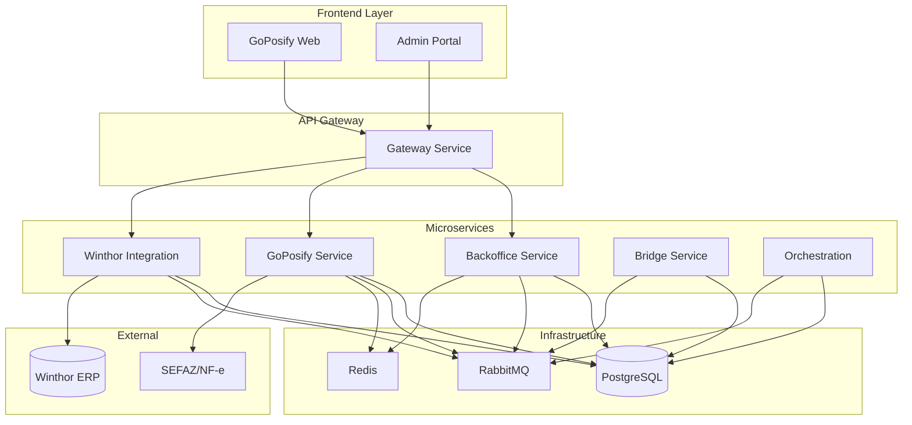

# Sistema ERP de Nova Geração

NWERP é uma plataforma completa de gestão empresarial (ERP) construída com arquitetura de microserviços, projetada para atender desde pequenas empresas até grandes corporações com múltiplas filiais.

<CardGroup cols={2}>
  <Card title="Início Rápido" href="/nwerp/quickstart">
    Configure seu ambiente em minutos
  </Card>
  <Card title="Arquitetura" href="/nwerp/architecture/overview">
    Entenda nossa arquitetura
  </Card>
  <Card title="Componentes" href="/nwerp/components/core">
    Explore os módulos do sistema
  </Card>
  <Card title="Deployment" href="/nwerp/deployment/infrastructure">
    Guias de implantação
  </Card>
</CardGroup>

---

## Por que NWERP?

<AccordionGroup>
  <Accordion title="Arquitetura Moderna" icon="building">
    Microserviços independentes e escaláveis construídos com .NET 9, permitindo evolução contínua sem impactar o sistema como um todo. Cada componente pode ser desenvolvido, testado e deployado de forma isolada.
  </Accordion>
  
  <Accordion title="Multi-tenant Nativo" icon="users">
    Suporte completo a múltiplos clientes (tenants) com isolamento total de dados. Cada tenant pode ter seus próprios databases, configurações e recursos alocados dinamicamente conforme o plano contratado.
  </Accordion>
  
  <Accordion title="Integrações Prontas" icon="link">
    Conectores nativos para integração com sistemas legados como Winthor ERP (Oracle), permitindo migração gradual e sincronização bidirecional de dados sem interromper operações atuais.
  </Accordion>
  
  <Accordion title="PDV Completo" icon="cash-register">
    Sistema de Ponto de Venda (GoPosify) moderno e responsivo, com suporte a emissão de NFC-e, múltiplas formas de pagamento, gestão de estoque em tempo real e dashboards analíticos.
  </Accordion>

  <Accordion title="Business Intelligence" icon="chart-line">
    Dashboards em tempo real, relatórios customizáveis e análises avançadas com cálculo automático de métricas como giro de estoque, curva ABC e projeções de demanda.
  </Accordion>

  <Accordion title="Segurança Enterprise" icon="shield">
    Autenticação JWT, autorização baseada em claims e roles, criptografia em trânsito (TLS) e em repouso, auditoria completa de operações e conformidade com LGPD.
  </Accordion>
</AccordionGroup>

---

## Stack Tecnológica

<CardGroup cols={3}>
  <Card title=".NET 9" icon="microsoft">
    **Backend**
    
    ASP.NET Core Web APIs, Entity Framework Core, Dapper, MediatR, FluentValidation
  </Card>
  
  <Card title="Angular 17+" icon="angular">
    **Frontend**
    
    TypeScript, RxJS, PrimeNG, Chart.js, Progressive Web App (PWA)
  </Card>
  
  <Card title="PostgreSQL 16" icon="database">
    **Banco de Dados**
    
    Database principal, Multi-tenant isolation, Replicação e High Availability
  </Card>
  
  <Card title="RabbitMQ" icon="rabbit">
    **Mensageria**
    
    Comunicação assíncrona, Event-driven architecture, Garantia de entrega
  </Card>
  
  <Card title="Redis 7" icon="bolt">
    **Cache**
    
    Cache distribuído, Session storage, Rate limiting, Pub/Sub
  </Card>
  
  <Card title="Docker" icon="docker">
    **Containers**
    
    Containerização completa, Docker Compose, Kubernetes ready
  </Card>
</CardGroup>

### Ferramentas e Bibliotecas

<Tabs>
  <Tab title="Backend">
    - **MassTransit** - Message bus e sagas
    - **Hangfire** - Background jobs e agendamentos
    - **Polly** - Resilience patterns (retry, circuit breaker)
    - **Serilog** - Logging estruturado
    - **Refit** - HTTP clients tipados
    - **AutoMapper** - Object mapping
    - **Swashbuckle** - OpenAPI/Swagger
  </Tab>
  
  <Tab title="Frontend">
    - **PrimeNG** - Biblioteca de componentes UI
    - **NgRx** - State management (opcional)
    - **RxJS** - Programação reativa
    - **Chart.js** - Gráficos e visualizações
    - **TailwindCSS** - Utility-first CSS
    - **Angular PWA** - Progressive Web App
  </Tab>
  
  <Tab title="DevOps">
    - **Kubernetes** - Orquestração de containers
    - **Helm** - Package manager K8s
    - **Prometheus** - Métricas e alertas
    - **Grafana** - Dashboards de monitoramento
    - **OpenTelemetry** - Distributed tracing
    - **cert-manager** - Gestão de certificados SSL
  </Tab>
  
  <Tab title="Qualidade">
    - **xUnit** - Testes unitários
    - **NSubstitute** - Mocking
    - **FluentAssertions** - Assertions legíveis
    - **Testcontainers** - Testes de integração
    - **SonarQube** - Análise de código
    - **Coverlet** - Code coverage
  </Tab>
</Tabs>

---

## Arquitetura do Sistema



---

## Módulos Principais

<CardGroup cols={2}>
  <Card title="Backoffice" icon="building" href="/nwerp/components/backoffice">
    **Gestão Multi-tenant**
    
    - Criação e gestão de tenants
    - Planos e assinaturas
    - Alocação dinâmica de recursos
    - Controle de compras e licenças
    - Gestão de databases e hosts
  </Card>
  
  <Card title="GoPosify" icon="cash-register" href="/nwerp/components/goposify">
    **Sistema PDV Completo**
    
    - Frente de caixa moderna
    - Gestão de vendas e devoluções
    - Controle de estoque
    - Emissão de NFC-e/NF-e
    - Relatórios e dashboards
  </Card>
  
  <Card title="Winthor Integration" icon="link" href="/nwerp/components/winthor">
    **Integração ERP Legado**
    
    - Sincronização bidirecional
    - Carga completa de dados
    - Cálculo de giro dia
    - Gestão de estoque ideal
    - Background jobs automáticos
  </Card>
  
  <Card title="Core Components" icon="cube" href="/nwerp/components/core">
    **Infraestrutura Compartilhada**
    
    - Bibliotecas comuns
    - Abstrações e contratos
    - Bootstrappers
    - Service defaults
    - HTTP AMQP Broker
  </Card>
</CardGroup>

---

## Funcionalidades Destaque

### 📦 Gestão de Estoque Inteligente

- **Giro Dia Automático**: Cálculo automático baseado em múltiplos cenários e períodos históricos
- **Estoque Ideal**: Sugestões de compra baseadas em vendas reais e sazonalidade
- **Curva ABC**: Classificação automática de produtos por importância
- **Inventário Rotativo**: Contagem de estoque com ajustes automáticos
- **Transferências**: Movimentação entre filiais com rastreabilidade completa

### 💼 Gestão Comercial

- **Orçamentos e Pedidos**: Conversão automática de orçamentos em pedidos
- **Força de Vendas**: App mobile para vendedores externos
- **Cotações**: Comparação de preços de múltiplos fornecedores
- **Devoluções**: Processamento de devoluções com reembolso ou crédito
- **Múltiplos Preços**: Tabelas de preços por cliente, região ou canal

### 📊 Fiscal e Contábil

- **NFC-e/NF-e**: Emissão integrada com SEFAZ
- **SPED Fiscal**: Geração automática de arquivos fiscais
- **Contas a Pagar/Receber**: Gestão financeira completa
- **Fluxo de Caixa**: Projeções e análise de liquidez
- **DRE**: Demonstração de resultados em tempo real

### 🔄 Integrações

- **Winthor ERP**: Sincronização completa com sistema legado
- **E-commerce**: APIs para integração com lojas virtuais
- **Meios de Pagamento**: PIX, cartões, boletos
- **Transportadoras**: Rastreamento e emissão de etiquetas
- **Contabilidade**: Exportação para sistemas contábeis

---

## Comece Agora

<Steps>
  <Step title="Clone o Repositório">
    ```bash
    git clone https://github.com/your-org/nwerp.git
    cd nwerp
    ```
  </Step>

  <Step title="Configure o Ambiente">
    ```bash
    # Configurar variáveis de ambiente
    ./setup-env.sh
    
    # Ou manualmente
    cp .env.example .env
    # Edite o arquivo .env com suas configurações
    ```
  </Step>

  <Step title="Inicie a Infraestrutura">
    ```bash
    # Iniciar PostgreSQL, RabbitMQ, Redis
    docker-compose -f docker-compose-infra.yml up -d
    
    # Verificar status
    docker-compose -f docker-compose-infra.yml ps
    ```
  </Step>

  <Step title="Execute o Backoffice">
    ```bash
    cd backoffice
    dotnet run --project NWERP.Backoffice.AppHost
    
    # Acesse: https://localhost:7001
    ```
  </Step>

  <Step title="Execute o GoPosify">
    ```bash
    # Backend
    docker-compose -f docker-compose.pos-backend.yml up -d
    
    # Frontend
    cd nwerp-goposify/NWERP.GoPosify.ClientApp
    npm install
    npm start
    
    # Acesse: http://localhost:4200
    ```
  </Step>
</Steps>

<Check>
  **Ambiente configurado!** Acesse nosso [Guia Completo de Início Rápido](/nwerp/quickstart) para mais detalhes e troubleshooting.
</Check>

---

## Casos de Uso

<Tabs>
  <Tab title="Varejo">
    **Loja Física e E-commerce**
    
    - PDV integrado com e-commerce
    - Estoque unificado multi-canal
    - Emissão de NFC-e no balcão
    - Sincronização automática de preços
    - Programa de fidelidade
    - Relatórios de vendas em tempo real
  </Tab>
  
  <Tab title="Distribuição">
    **Atacado e Distribuidor**
    
    - Gestão de múltiplas filiais
    - Força de vendas mobile
    - Pedidos por representantes
    - Cálculo de comissões
    - Roteirização de entregas
    - Integração com transportadoras
  </Tab>
  
  <Tab title="Indústria">
    **Produção e Manufatura**
    
    - Controle de matéria-prima
    - Ordem de produção
    - Gestão de fórmulas/receitas
    - Rastreabilidade de lotes
    - Custos de produção
    - Integração com WMS
  </Tab>
  
  <Tab title="Serviços">
    **Prestação de Serviços**
    
    - Ordem de serviço
    - Agendamentos
    - Gestão de contratos
    - Faturamento recorrente
    - Time tracking
    - Portal do cliente
  </Tab>
</Tabs>
